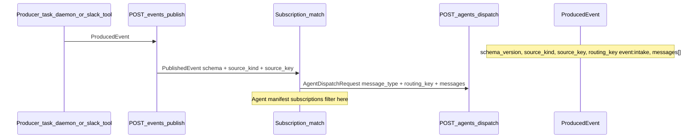
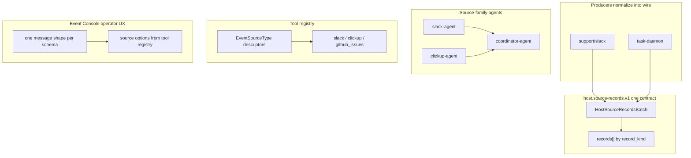

# Clean pub/sub for `host.source-records.v1`

## Fabricator correction: source types belong in the tool registry

The source-kind namespace must not be owned by the Event Console. The console is an operator
projection over the same metadata agents and tools use. The registry of source types belongs with
tool metadata:

- Today [`ToolFunctionMetadata`](crates/baml-rt-tools/src/tools.rs) has only
  `event_sources: Vec<EventSourceKind>` (bare strings).
- `support/slack` declares `event_sources = ["slack"]` in
  [`crates/tools/slack/src/lib.rs`](crates/tools/slack/src/lib.rs).
- [`list_event_sources.rs`](crates/cargo-agent-platform/src/commands/list_event_sources.rs)
  already treats tool inventory as the authority, but has to patch in `clickup` and
  `github_issues` through `KNOWN_COMPATIBILITY_SOURCE_KINDS` in
  [`event_schemas.rs`](crates/cargo-agent-platform/src/event_schemas.rs).

That compatibility array is the impurity. ClickUp/GitHub source types exist because task-daemon
can publish them, so they need a tool-registry descriptor just like Slack. The Event Console should
query source types from the registry and compose them with the wire schema shape.

## Fabricator correction: source delivery belongs to source-family agents

`semantic-ingress-agent` is currently a curated Slack-only dispatch agent:

- [`agents/semantic-ingress-agent/manifest.json`](agents/semantic-ingress-agent/manifest.json)
  subscribes to `host.source-records.v1` for `source_kinds: ["slack"]`.
- [`agents/semantic-ingress-agent/src/index.ts`](agents/semantic-ingress-agent/src/index.ts)
  groups Slack raw records into conversations, optionally calls `support/slack` to fetch missing
  thread context, derives work, discovers `project-management:create-task`, and delegates through
  `system/internal_a2a`.
- [`agents/slack-agent/manifest.json`](agents/slack-agent/manifest.json) is currently a
  conversational/read-only Slack assistant and declares no dispatch subscription.

That means Slack has two curated agents: one for conversation (`slack-agent`) and one for source
ingress (`semantic-ingress-agent`). This violates the single source-family mechanism. The cleaner
cutover is:

- `slack-agent` owns Slack meaning and subscribes to `host.source-records.v1` / `slack`.
- `clickup-agent` owns ClickUp meaning and subscribes to `host.source-records.v1` / `clickup`.
- A future GitHub/source agent owns `github_issues`.
- `coordinator-agent` remains the cross-source orchestrator/delegator when a source-family agent
  chooses to escalate; it should not be the direct subscriber for every raw source kind unless the
  source has no family agent yet.
- `semantic-ingress-agent` is retired, or its logic is merged into `slack-agent` and the old package
  deleted.

## What is already correct (runtime pub/sub)

The host bus is **not** Slack-special. Delivery uses a consistent pipeline:



- **Subscription match** ([`event_subscription.rs`](crates/baml-rt-core/src/event_subscription.rs)): `schema_version` AND `source_kind` (plus optional key/prefix) — this is the right pub/sub filter. Coordinator subscribing to `clickup` + `github_issues` is correct.
- **Dispatch envelope** ([`dispatch.rs`](crates/baml-rt-core/src/dispatch.rs)): `message_type` = schema; payload is opaque `messages[]`. `source_kind` lives on `ProducedEvent` for matching, not duplicated as a top-level dispatch field.
- **Routing key**: production path already uses **`event:intake`** ([`contract.rs`](crates/task-daemon/src/contract.rs), [`slack/producer.rs`](crates/tools/slack/src/producer.rs)). Legacy `slack:intake` / `clickup:intake` in [`task-daemon/model.rs`](crates/task-daemon/src/model.rs) are dead weight.

## What is wrong (operator layer + registry drift)

### 1. Event Console double-filters by `source_kind`

[`messageShapes.ts`](web/src/events/messageShapes.ts) `subscriptionMatchesShape` requires the **registry shape’s** `source_kind` to match the agent subscription. The registry only registers **one Slack-titled shape** ([`registry.rs`](crates/baml-rt-api/src/event_console/registry.rs) `slack-source-records`). Coordinator never sees a shape → empty Message type → no JSON schema form.

This is **not** pub/sub semantics; it is a registry/UI bug. Subscriptions already express source_kind.
Shapes should describe **wire contracts**, while source kinds should come from **tool-registry source
type descriptors**.

### 2. Slack is special-cased because only Slack is registered as a source-producing tool

[`SlackNormalizedBatch`](crates/tools/slack/src/normalize.rs) is already the canonical batch envelope:

- `schema_version`, `emitted_at_unix`, `source { source_kind, source_key, source_label }`, `records[]` with `record_kind` tag.

ClickUp from task-daemon ([`source_records.rs`](crates/task-daemon/src/source_records.rs)) emits the **same outer envelope** but:

- adds `project`
- uses ad-hoc `json!` records (`clickup.lifecycle_task`) instead of the shared type
- bypasses the slack normalize module entirely

So Slack is not a different **protocol**—it is the only producer wired into typed tool metadata.
ClickUp/GitHub are published by task-daemon but not represented as source types in the registry.

### 3. Per-source routing keys (legacy)

`TaskSourceKind::intake_routing_key()` still documents `slack:intake`, `clickup:intake`, etc. Conflicts with cutover to `event:intake` and confuses docs/tests.

## Target architecture (clean pub/sub)

- **Wire contract**: `EventSchemaVersion`, e.g. `host.source-records.v1`. One JSON batch shape for all source kinds.
- **Source type**: `EventSourceKind` plus descriptor from tool registry, e.g. `slack`, `clickup`, `github_issues`.
- **Publish routing**: `PublishedEvent { schema, source_kind, source_key }`. Unchanged.
- **Agent subscription**: `schema_versions` + `source_kinds` (+ optional keys). Unchanged.
- **Dispatch**: `routing_key: event:intake`, `message_type: host.source-records.v1`, `messages[]`. Unchanged.
- **Event Console**: one shape per wire schema, source type dropdown/sample options from the tool registry.
- **Source-family agent**: owns source-specific interpretation/enrichment for its source type
  (`slack-agent`, `clickup-agent`, future GitHub agent).
- **Coordinator**: optional downstream orchestration target, not the default raw-source subscriber
  for sources with a family agent.
- **Record bodies**: `record_kind` tagged union inside `records[]`. Agents interpret; host does not.



## Implementation plan

### Phase A — Source types are first-class tool-registry metadata

**Metadata type** ([`crates/baml-rt-tools/src/tools.rs`](crates/baml-rt-tools/src/tools.rs)):

- Introduce an `EventSourceType` / `ToolEventSourceDescriptor` struct alongside `EventSourceKind`.
- Fields should include:
  - `kind: EventSourceKind`
  - `display_name`
  - `description`
  - `wire_schema_versions: Vec<EventSchemaVersion>` (initially `host.source-records.v1`)
  - `default_routing_key: AgentDispatchRoutingKey` (initially `event:intake`)
  - optional `sample_source_key`
  - optional `sample_payload` or sample builder reference if we keep samples server-side
- Keep `event_sources: Vec<EventSourceKind>` as a derived/backcompat view during the cutover, but make the descriptor list the authoritative field.

Recommended concrete shape:

```rust
pub struct EventSourceTypeDescriptor {
    pub kind: EventSourceKind,
    pub display_name: String,
    pub description: String,
    pub wire_schema_versions: Vec<EventSchemaVersion>,
    pub default_routing_key: AgentDispatchRoutingKey,
    pub sample_source_key: Option<EventSourceKey>,
    pub sample_payload: Option<serde_json::Value>,
}
```

Add `event_source_types: Vec<EventSourceTypeDescriptor>` to `ToolFunctionMetadata`. During cutover,
`event_sources: Vec<EventSourceKind>` stays as a derived compatibility projection for existing code
(`ToolDiscoveryRecord`, exports, `EventProducerProvider` validation, and old agents).

**Catalog projection**:

- Add an `EventSourceTypeCatalog` interface over `ToolCatalog` inventory:

```rust
pub trait EventSourceTypeCatalog {
    fn event_source_types(&self) -> Vec<EventSourceTypeDescriptor>;
    fn event_source_type(&self, kind: &EventSourceKind) -> Option<EventSourceTypeDescriptor>;
}
```

- Blanket-implement it for `T: ToolCatalog` by scanning `catalog.iter()` and deduping descriptors
  by `kind`.

**Derive macro** ([`crates/baml-tool-derive`](crates/baml-tool-derive)):

- Extend `#[baml_tool(...)]` to support descriptor syntax, for example:

```rust
event_sources = [
  { kind = "slack", schema = "host.source-records.v1", routing_key = "event:intake", description = "Slack source record batches" }
]
```

- Keep old `event_sources = ["slack"]` accepted only as a shorthand that expands to a descriptor with defaults, or migrate existing declarations in the same change if we want a full cutover.

**Tool ownership**:

- `support/slack` owns `slack`.
- `support/clickup` owns `clickup` as a source type descriptor, even if task-daemon currently
  operationalizes the polling/publish path.
- `github_issues` should be owned by a real GitHub/source descriptor. If there is no GitHub tool
  crate yet, add a metadata-only host-source registry entry under `crates/tools/system` or introduce
  a `support/github-issues` metadata-only tool. Do not keep it in Event Console or CLI constants.
- Remove `KNOWN_COMPATIBILITY_SOURCE_KINDS` once ClickUp/GitHub come from descriptors.

### Phase B — Discovery surface exposes source types

**Tool discovery**:

- Extend `ToolDiscoveryRecordDto` in [`crates/tools/system/src/tools.rs`](crates/tools/system/src/tools.rs):
  - Keep `event_sources: Vec<String>` for old agents.
  - Add `event_source_types: Vec<EventSourceTypeDto>`.

**CLI**:

- [`list_event_sources.rs`](crates/cargo-agent-platform/src/commands/list_event_sources.rs) should render descriptors from inventory, not `KNOWN_COMPATIBILITY_SOURCE_KINDS`.

**Event Console API**:

- Add a source-type registry endpoint or fold descriptors into `/message-shapes`.
- Preferred clean split:
  - `/message-shapes`: wire schema contracts (`host.source-records.v1`, `system.callback.v1`)
  - `/event-source-types`: source type descriptors from tool registry

### Phase C — Event Console matches pub/sub (fixes coordinator)

**Registry** ([`registry.rs`](crates/baml-rt-api/src/event_console/registry.rs)):

- Replace `slack_source_records()` with **`host_source_records()`**:
  - `message_shape_id`: `host-source-records`
  - `display_name`: `Host source records (v1)` (not "Slack raw…")
  - `wire_schema_version`: `host.source-records.v1`
  - **Drop shape-level `source_kind` as a filter key** (keep optional field only as default for envelope autofill, or move to samples — see below)
  - `delivery_defaults.routing_key`: `event:intake`
  - Samples should be source-type samples from tool-registry descriptors, not hardcoded registry branches.
  - `payload_schema`: JSON Schema for the **shared batch envelope** (loose `records` items with required `record_kind`, or schemars from Phase B type)

**UI** ([`messageShapes.ts`](web/src/events/messageShapes.ts)):

- Change `subscriptionMatchesShape`: match **`wire_schema_version` only** against `sub.schema_versions`; do **not** require a shape-owned source kind.
- Filter/select source types separately: intersection of agent subscription `source_kinds` and registry source descriptors for the selected wire schema.
- When picking a sample / autofill: set dispatch envelope `sourceKind` from the selected source type.
- Add optional `source_kind` on `MessageShapeSample` in [`types/events.ts`](web/src/types/events.ts) if envelope derivation needs it per sample.

**Validation** ([`validation.rs`](crates/baml-rt-api/src/event_console/validation.rs)):

- `find_message_shape_by_wire(message_type, _)` — lookup by schema only (deprecate source_kind parameter for registry lookup).
- Still validate operator-provided `source_kind` against **agent subscription** and payload `source.source_kind` consistency.

**Tests**: Update [`messageShapes.test.ts`](web/src/events/messageShapes.test.ts) to expect one shape + subscription filtering by schema; coordinator-agent + clickup-only subscription gets the same shape with clickup sample default.

### Phase D — Source-family agent ownership

**Slack**:

- Move `semantic-ingress-agent` dispatch logic into [`agents/slack-agent/src/index.ts`](agents/slack-agent/src/index.ts):
  - add `HostDispatchRequest` / `HostDispatchAck` imports
  - add `onDispatch` accepting `host.source-records.v1` + `event:intake`
  - keep existing conversational Slack assistant behavior under `run`
  - preserve enrichment through `support/slack`
  - preserve downstream delegation through `system/discover_agents` + `system/internal_a2a`
- Add `discovery.subscriptions` to [`agents/slack-agent/manifest.json`](agents/slack-agent/manifest.json):

```json
{
  "schema_versions": ["host.source-records.v1"],
  "source_kinds": ["slack"]
}
```

- Delete [`agents/semantic-ingress-agent`](agents/semantic-ingress-agent) after tests move.

**ClickUp**:

- Add/confirm `onDispatch` in `clickup-agent` for `host.source-records.v1` + `clickup`.
- ClickUp source records should be interpreted by `clickup-agent`; it may delegate to coordinator
  only when cross-agent orchestration is needed.

**Coordinator**:

- Remove broad raw source subscriptions from [`agents/coordinator-agent/manifest.json`](agents/coordinator-agent/manifest.json)
  once source-family agents own their source kinds.
- Coordinator remains discoverable by capabilities and callable via A2A/internal delegation.

### Phase E — Canonical wire type (remove Slack-only naming)

- Add `HostSourceRecordsBatch` + `HostSourceRecordsRecord` (serde + JsonSchema) in **`baml-rt-core`** (or shared vocabulary crate), generalized from [`SlackNormalizedBatch`](crates/tools/slack/src/normalize.rs).
  - `records`: enum or `Vec<serde_json::Value>` with schema documenting known `record_kind` values: `slack.message`, `clickup.lifecycle_task`, …
  - Optional `project`, optional `transport` (slack-only field)
- `baml-tools-slack`: type alias or thin wrapper re-exporting core type (avoid breaking slack tool overnight).
- `task-daemon/source_records.rs`: build `HostSourceRecordsBatch` for **all** non-slack polls (and ideally slack path calls same builder).

### Phase F — Routing hygiene

- Remove or deprecate [`TaskSourceKind::intake_routing_key`](crates/task-daemon/src/model.rs) per-source keys; tests/docs reference `event:intake` only.
- Confirm semantic-ingress and coordinator agents reject non-`event:intake` routing keys (already in agent code).

### Phase G — Docs

- Update [`host-to-agent-event-delivery.md`](docs/assertions/host-to-agent-event-delivery.md): Event Console section — shapes are **schema-scoped**; `source_kind` is subscription/publish metadata, not a separate message-shape dimension.
- Document that source types are registered through tool/source metadata, not Event Console code.
- Document the source-family agent rule: raw source records go first to the source-family agent
  (`slack-agent`, `clickup-agent`, etc.); coordinator is a downstream orchestrator.
- [`task-daemon-event-contract.md`](docs/reference/task-daemon-event-contract.md): point at `HostSourceRecordsBatch`, not Slack-specific types.

## What we explicitly reject

- **Adding `clickup-source-records` + `github-issues-source-records` as separate registry shapes** — duplicates pub/sub dimensions and recreates this bug for the next source kind.
- **Adding `slack` to coordinator manifest** just to satisfy the broken UI filter — wrong agent boundary; masks the registry bug.
- **Keeping `semantic-ingress-agent` as a separate curated Slack intake agent** — duplicates
  `slack-agent` and violates the source-family ownership rule.
- **Keeping `KNOWN_COMPATIBILITY_SOURCE_KINDS` as the authority** — compatibility constants are a bridge, not the registry.
- **Generic fallback schema with no validation** when shape missing — operators lose contract safety.

## Verification

1. `GET /message-shapes` → one `host-source-records` schema entry.
2. Source-type discovery → `slack`, `clickup`, `github_issues` from tool/source registry descriptors.
3. Event Console `slack-agent` → same message shape, source type choice is `slack`.
4. Event Console `clickup-agent` → same message shape, source type choice is `clickup`.
5. Coordinator remains available for downstream delegation but is not required as the direct raw-source subscriber.
6. `cargo test -p baml-rt-api event_console` + `web` vitest `messageShapes.test.ts`.
7. Optional: publish from task-daemon dry-run → source-family agent accepts `host.source-records.v1` + `event:intake`.

## Risk

| Risk | Mitigation |
|------|------------|
| JSON Schema too strict for heterogeneous `records[]` | Use `oneOf` per `record_kind` or validate envelope only + warn on unknown record kinds |
| Moving types out of slack crate breaks imports | Re-export aliases; single PR with compile fixes |
| Operators relied on shape display names per source | Sample labels ("ClickUp poll window") preserve UX |
