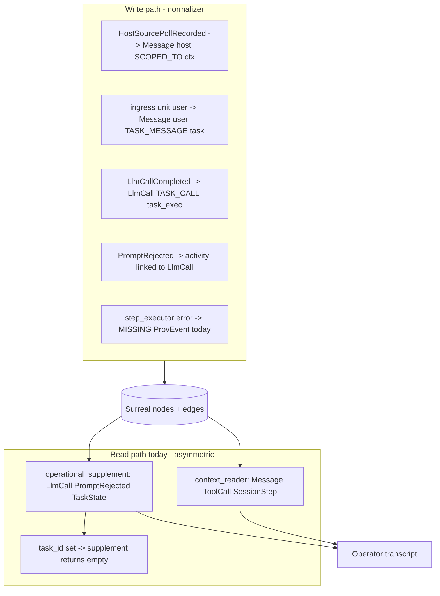

# Event Console Operator Observability (Graph-First)

## Design constraints (non-negotiable)

From [`conversation_context_pipeline.rs`](crates/baml-rt-provenance/src/surreal_store/conversation_context_pipeline.rs), [`baml-rt-conversation-spec.md`](docs/assertions/baml-rt-conversation-spec.md), and metamodel edge docs:

| Constraint | Implication for this work |
|------------|---------------------------|
| **Read–write symmetry** | Every row the operator transcript shows must be a graph node the normalizer wrote with typed edges. Reads traverse those edges; reads must not invent, suppress, or merge rows the write path did not model. |
| **Relational modelling via edges** | Scope = `SCOPED_TO` (context), task scope = `A2A_TASK_MESSAGE` / `A2A_TASK_CALL`, failures = existing `LlmCall` outcome + `PromptRejected` activity linked to prompt/LlmCall — not parallel SQL “supplement” tables. |
| **Efficiency** | One scoped graph query per conversation-history page (extend labels in existing traversal), not main query + [`operational_context_supplement.rs`](crates/baml-rt-provenance/src/surreal_store/operational_context_supplement.rs) bolt-on. Reuse [`GraphQuery`](crates/baml-rt-provenance/src/metamodel/query.rs) for ProvenancePane ops. |
| **Fix writes, not reads** | No UI dedup, no read-time “suppress poll when unit exists”, no `task_id.is_some() => skip failures`. Idempotent UPSERT + deterministic `a2a_event_order`. |

Episode export (`conversation_transcript`) is **intentionally asymmetric** — agent-facing projection drops `Operational`. Operator surfaces use `profile=full` conversation-history = graph traversal. Do not merge those contracts.

---

## Diagnosis (reframed)

**Observed gaps map to symmetry breaks:**

1. **`PromptRejected` write fails** — emitted in a second `add_event` without in-session `llm_event_to_scope_ordinal`; normalization errors are swallowed ([`store.rs`](crates/baml-rt-provenance/src/store.rs) `add_event_with_logging`). Graph never gets the node → supplement cannot find it even when enabled.

2. **`operational_context_supplement` is a second read model** — raw SQL over `SCOPED_TO`, separate from main `fetch_scoped_conversation_nodes`, disabled entirely when `task_id` is set ([`operational_context_supplement.rs`](crates/baml-rt-provenance/src/surreal_store/operational_context_supplement.rs) L57–59). Task-scoped observe (dispatch-unit) loses all failure rows despite graph edges existing.

3. **Step executor / tool OPEN config errors** — no `ProvEvent` + edges; logs only. Read path has nothing to traverse.

4. **Poll + unit ingress are not duplicates** — failed test [`record_source_poll_and_unit_prelude_emit_single_ingress_user_line`](crates/baml-rt-provenance/tests/host_ingress_events_test.rs) expects 1 row but graph correctly has 2:
   - Context-scoped host `Message` (poll operational)
   - Task-scoped ingress `user` `Message` (`TASK_MESSAGE`)
   Different anchors, different edges — **valid graph truth**. Fix: test + causal `event_order` (poll before unit), not read dedup.

5. **ProvenancePane ops** — wrong `agentId` filter (`agent_package` vs instance); ops query semantics diverge from conversation scoping ([`EventConsole.vue`](web/src/components/events/EventConsole.vue) L489).

---

## Target architecture

### Write path (persistence)

| Event | Graph shape | Ordering |
|-------|-------------|----------|
| `HostSourcePollRecorded` | `Message` (host operational), `SCOPED_TO` context | Lowest order in publish window |
| Unit ingress prelude | `Message` (user, ingress metadata), `A2A_TASK_MESSAGE` | After poll, before agent `LlmCall` |
| `LlmCallCompleted` (failed) | `LlmCall` node, `a2a_activity_outcome=Failed`, `A2A_TASK_CALL` | Monotonic per task_exec |
| `PromptRejected` | `PromptRejected` activity + edges to linked `LlmCall`/prompt | Same batch or graph-resolved link at normalize time |
| Step/tool config fatal | `ToolCall`/`ToolResult` error completion **or** dedicated operational `Message` with `TASK_CALL` edge | Same FSM as successful tools |

**PromptRejected fix (write-side):** In [`normalizer.rs`](crates/baml-rt-provenance/src/normalizer.rs), when `llm_event_to_scope_ordinal` misses, **resolve scope+ordinal by traversing persisted graph** from `llm_call_activity_anchor` (edge lookup, not string prefix). Keeps effect_subscriber’s two-phase emit; makes normalize idempotent with stored relations.

**Step executor fix (write-side):** Emit a normalizer-backed event (tool session abort with error payload or operational host/system message) scoped via existing `attach_task_call_context` — same edges agent chat uses.

### Read path (single traversal)

**Full cutover:** Extend [`conversation_context_filtered`](crates/baml-rt-provenance/src/surreal_store/context_reader.rs) scoped node fetch to include labels already written with `SCOPED_TO` / task edges:

- `Message` (existing — host ingress + user + agent)
- `ToolCall`, `SessionStep` (existing)
- `LlmCall` (failed → `llm_call_failed` operational projection)
- `PromptRejected` (→ `prompt_rejected` operational projection)
- `TaskState` (terminal → `task_status_changed`)

Task filter: reuse same `TASK_MESSAGE` / `TASK_CALL` edge SQL as today — **no early return that skips failure labels**.

**Delete** [`load_operational_supplement_items`](crates/baml-rt-provenance/src/surreal_store/operational_context_supplement.rs) after parity tests pass (one query, one projection loop).

Sort: `a2a_event_order` ASC, `activity_anchor` tie-break everywhere ([`paginate_items`](crates/baml-rt-api/src/conversation_history.rs), [`conversationHistoryHydration.ts`](web/src/chat/conversationHistoryHydration.ts)) — matches write causal order.

### Ops / ProvenancePane (same edge semantics)

- [`ProvenancePane.vue`](web/src/components/ProvenancePane.vue): `baseScope()` uses `agentPackage` query param (or omit filter); include `taskId` when observing dispatch-unit.
- [`EventConsole.vue`](web/src/components/events/EventConsole.vue): stop passing `draft.agent_package` as `agentId`; wire [`resolveDispatchUnitTaskId`](web/src/events/dispatchObserve.ts) after publish.
- Backend ops already use [`GraphQuery::for_agent_package`](crates/baml-rt-provenance/src/metamodel/query.rs) — align UI to that contract.

### Projections (two consumers, one graph)

| Consumer | Mechanism | Failures visible? |
|----------|-----------|-------------------|
| Agent BAML | [`projection.rs`](crates/baml-rt-conversation/src/projection.rs) drops `Operational` | No (by design) |
| Operator Event Console | `profile=full` conversation-history | Yes (graph traversal) |
| Episode export | Episode reader + BAML projection | Aggregates only (`llm_call_count`); add optional `## operator_events` appendix sourced from same history query if needed |

---

## Implementation phases

### Phase 1 — Write symmetry (Rust, P0)

1. PromptRejected graph-resolved normalization (linked LlmCall lookup).
2. Step/tool config failure ProvEvents with TASK_CALL / tool FSM edges.
3. Verify host ingress idempotent UPSERT (`HostIngressPollKey`); adversarial double-write test.
4. Assign monotonic `a2a_event_order`: poll → unit ingress → dispatch outcomes → agent calls.

### Phase 2 — Unified read traversal (Rust, P0)

1. Extend `fetch_scoped_conversation_nodes` / main match arms for `LlmCall`, `PromptRejected`, `TaskState`.
2. Apply task edge filter uniformly (remove supplement early return).
3. Remove `operational_context_supplement` module after snapshot/API tests updated.
4. Update `record_source_poll_and_unit_prelude` test: expect **2 rows**, poll before unit, distinct anchors.

### Phase 3 — UI scope alignment (Web, P1)

1. ProvenancePane agent scope fix + taskId in ops queries.
2. Wire `resolveDispatchUnitTaskId` after publish.
3. EventRunStatusBanner / MessageBubble: surface operational errors already in graph (no new dedup).

### Phase 4 — Docs (P1)

1. [`docs/assertions/host-to-agent-event-delivery.md`](docs/assertions/host-to-agent-event-delivery.md): single read traversal; poll vs unit edge topology.
2. [`docs/assertions/baml-rt-conversation-spec.md`](docs/assertions/baml-rt-conversation-spec.md): operator vs agent projection; no read-time suppression.

---

## Tests

| Test | Asserts |
|------|---------|
| `prompt_rejected_persists_after_separate_add_event` | Graph node + `PromptRejected` edge to LlmCall |
| `task_scoped_history_includes_failed_llm_and_prompt_rejected` | `conversation_context_with_task` returns failure operational rows |
| `poll_and_unit_are_two_distinct_graph_rows_ordered` | Replaces stale `len == 1` assertion |
| `host_source_poll_is_idempotent_on_double_write` | One poll Message node |
| API snapshot | `profile=full` with taskId includes failures |
| Web | ProvenancePane counts non-zero with correct scope |

---

## Risks

| Change | Risk |
|--------|------|
| Unified read (drop supplement) | Medium — must cover all former supplement labels in main loop |
| Graph lookup in normalizer | Low — falls back only when in-session map empty |
| Poll + unit both visible | Low — correct graph truth; ordering fix may change UI layout |

Legacy DB rows with old anchors may still look odd until contexts are re-run; new writes follow derived identity.

---

## Out of scope

- Read-time dedup in Vue or `dispatchObserve.ts`
- Collapsing poll operational row when unit ingress exists (violates graph truth)
- Making BAML `conversation_transcript` include operational rows (agent contract unchanged)
