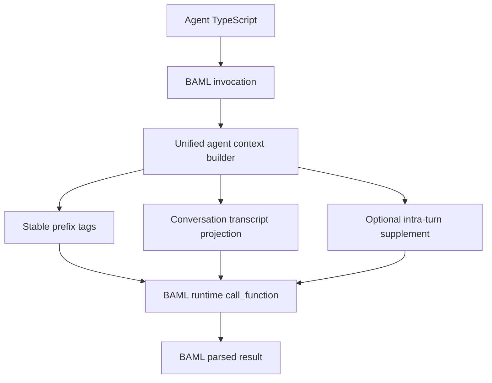

# Unified `execute_function` full cutover

## Decision

Use **unified `execute_function`** as the full-cutover architecture.

Do **not** force every plain planning/classification/synthesis call into a synthetic `runGeneratedStepExecutor` session. Instead, make the direct BAML invocation path and the generated FSM path share the same host-controlled prompt substrate:

- one context/tag builder,
- one stable-prefix contract,
- one transcript projection contract,
- one cache-boundary strategy,
- one set of tests proving parity.

The machine-spirit remains free to expose ordinary BAML functions to TypeScript (`InferSlackIntent`, `ClassifyPersonaCoordinatorTurn`, `PersonaReact`, etc.), but their runtime context must be assembled with the same sacred machinery as step-executor hops. This gives us prefix-cache control without inventing artificial tool sessions for every reasoning hop.

## Current impurity

Today there are two effective prompt substrates:

- **Direct BAML calls**: `BamlExecutor::execute_function` builds `ctx_manager` through the normal `build_conversation_context_tags` path, then calls `runtime.call_function`.
- **Step-executor calls**: `run_step_executor_loop` calls `invoke_function_with_intra`, which uses `build_conversation_context_tags_with_intra`, injects `session_step_stable_prefix`, and preserves loop-local conversation history deltas.

Result: classification, planning, synthesis, and FSM hops can see different prefixes, different tag sets, and different cache breakpoints.

The trace that triggered this shows `GetDiscoverAgentsPlan__continue__system_discover_agents` still being primed by parent “Discover available agents…” text and generic `ctx.output_format`, even though only read/send/finish ops are legal. That is a symptom of a broader split: some prompts are under the FSM substrate; others are not.

## Target architecture



### Normative prompt stack

Every agent LLM hop should be built from the same logical stack:

1. **Host-controlled stable prefix**: archive/read policy, durable tool/session guidance, and any cache-critical invariant prose.
2. **Tool/schema prelude** where relevant: generated tool cards and session input/output classes, stable per package/tool manifest.
3. **Agent-authored task body**: the business prompt from `.baml`, kept lean and specific.
4. **Conversation transcript/history**: variable tail from graph projection plus optional intra-turn supplement.
5. **One output constraint**: `ctx.output_format`, narrowed phase footer, or equivalent compiler-visible BAML return type guidance.

Direct calls and FSM phase calls may have different **return types**, but not different **prefix assembly machinery**.

## Full cutover plan

### 1. Inventory execution paths

Read and compare:

- [`crates/baml-rt-quickjs/src/baml_execution.rs`](crates/baml-rt-quickjs/src/baml_execution.rs): `BamlExecutor::execute_function`, streaming variants, context manager construction, recovery parse path.
- [`crates/baml-rt-quickjs/src/baml/intra_turn.rs`](crates/baml-rt-quickjs/src/baml/intra_turn.rs): `build_conversation_context_tags_with_intra`, `merged_conversation_history_lines_json`, supplement merge/cap behavior.
- [`crates/baml-rt-quickjs/src/step_executor_loop.rs`](crates/baml-rt-quickjs/src/step_executor_loop.rs): how phase calls select function names, pass session context, and record intra-turn deltas.
- [`crates/baml-rt-tools/src/session_ctx_tags.rs`](crates/baml-rt-tools/src/session_ctx_tags.rs): current stable prefix constant and tag names.

Deliverable: a small map of which tags direct calls get versus which tags step-executor calls get.

### 2. Extract a shared context builder

Create one internal abstraction, likely in `baml/intra_turn.rs` or a new `baml/prompt_context.rs`, for agent-scoped prompt context assembly.

Proposed shape:

```rust
pub(crate) struct AgentPromptContextInput<'a> {
    pub scope: &'a context::RuntimeScope,
    pub intra_supplement: &'a [serde_json::Value],
    pub include_session_stable_prefix: bool,
}
```

It should produce the same `Option<HashMap<String, BamlValue>>` used by `create_ctx_manager_for_scope`.

Rules:

- Direct BAML calls use the builder with `intra_supplement = []`.
- Step-executor calls use the builder with their loop-owned supplement.
- Both paths receive the same stable host tags unless a tag is explicitly phase-only.
- The graph provider remains the source of truth; intra supplement only extends the live turn.

### 3. Define the stable prefix contract

Codify which tags are stable and where they belong:

- `session_step_stable_prefix`: archive handle/read-before-cite/read-before-repeat policy.
- `tool_schema_prelude`: generated package/tool schema content if available.
- `conversation_transcript`: variable transcript tail, always after stable prefix/prelude.
- `conversation_history`: structured rows for Jinja-aware prompts; also variable.
- Any future cache-control tag should be added through the same builder, not per-call ad hoc.

The exact wording of `SESSION_STEP_STABLE_PREFIX_VALUE` should stay centralized in [`crates/baml-rt-tools/src/session_ctx_tags.rs`](crates/baml-rt-tools/src/session_ctx_tags.rs).

### 4. Cut over direct `execute_function`

Change `BamlExecutor::execute_function` so its default context-tag path calls the shared builder.

Current direct flow roughly does:

```rust
let context_tags = match override_context_tags {
    Some(tags) => Some(tags),
    None => self.build_conversation_context_tags(scope).await?,
};
let ctx_manager = self.create_ctx_manager_for_scope(scope, context_tags)?;
```

Target flow:

```rust
let context_tags = match override_context_tags {
    Some(tags) => Some(tags),
    None => self.build_agent_prompt_context_tags(scope, &[]).await?,
};
let ctx_manager = self.create_ctx_manager_for_scope(scope, context_tags)?;
```

Where `build_agent_prompt_context_tags` is the same builder used by `invoke_function_with_intra`.

This is the full cutover: direct BAML functions remain direct, but no longer live outside the prompt/cache substrate.

### 5. Keep step-executor semantics, but remove special prompt machinery

Step executor still owns FSM state:

- function name narrowing (`Base__select`, `Base__act__tool`, `Base__continue__tool`),
- session context argument injection,
- Open/Send/SearchRead/PageRead/Finish legality,
- intra-turn supplement rows.

But it should not own a separate prompt-context worldview. It simply calls the shared builder with a non-empty supplement.

### 6. Clean up generated phase prompts

Update [`crates/baml-rt-builder/src/builder/baml_gen/session_from_ir.rs`](crates/baml-rt-builder/src/builder/baml_gen/session_from_ir.rs):

- Strip standalone `{{ ctx.output_format }}` from copied parent templates.
- Re-append exactly one output constraint at the end.
- Add a phase cue:
  - `SELECT`: read visible archive or open a tool.
  - `ACT`: first post-open send/read hop.
  - `CONTINUE`: read/refine/send/finish.
- Add compact phase footer listing legal variants, derived from the already computed return union.

This fixes prompts like `GetDiscoverAgentsPlan__continue__system_discover_agents`, where the legal return type is already narrowed but the visible prompt still reads like a fresh discovery request.

### 7. Agent prompt hygiene

Do not wrap every plain function in a fake FSM. Instead:

- Keep ordinary BAML functions for classification, planning, and synthesis.
- Remove duplicated stable policy prose from agent-authored prompts once the host injects it reliably.
- Keep business prompts focused on the task.
- Ensure session-plan parents omit standalone `ctx.output_format` when codegen strips/re-appends it.

Priority audit targets:

- [`tests/fixtures/agents/conversational-persona-demo/baml_src/persona_prompt.baml`](tests/fixtures/agents/conversational-persona-demo/baml_src/persona_prompt.baml)
- [`agents/slack-agent/baml_src/slack_prompt.baml`](agents/slack-agent/baml_src/slack_prompt.baml)
- [`agents/notion-agent/baml_src/notion_prompt.baml`](agents/notion-agent/baml_src/notion_prompt.baml)
- [`agents/clickup-agent/baml_src/clickup_prompt.baml`](agents/clickup-agent/baml_src/clickup_prompt.baml)

### 8. Tests

Add focused tests before broad fixture regeneration:

- Direct `execute_function` context includes the same stable tags as intra-turn builder with empty supplement.
- Intra-turn builder with supplement preserves prefix rows and appends live deltas only.
- A generated `__continue__` prompt contains one output constraint, phase cue/footer, and no duplicate parent output-format block.
- A plain classifier function and an FSM phase function both receive host stable prefix tags.

Suggested locations:

- `crates/baml-rt-quickjs/src/baml/intra_turn.rs` unit tests for tag builder parity.
- `crates/baml-rt-builder/src/builder/baml_gen/session_from_ir.rs` unit tests for strip/footer codegen.
- One integration fixture test for conversational persona or task lifecycle after regen.

### 9. Regenerate and verify

After implementation:

- `cargo test -p baml-rt-quickjs --lib`
- `cargo test -p baml-rt-builder session_from_ir`
- `cargo clippy -p baml-rt-quickjs -p baml-rt-builder --all-targets -- -D warnings`
- `just regen-fixtures`
- Spot-check `tests/fixtures/agents/conversational-persona-demo/baml_src/_baml_runtime.baml` for `GetDiscoverAgentsPlan__continue__system_discover_agents`.

### 10. Documentation

Update [`docs/assertions/how-to-write-agents.md`](docs/assertions/how-to-write-agents.md):

- Direct BAML calls and FSM phase calls share the same host context substrate.
- Authors should not duplicate archive/tool/cache policy prose inside prompts.
- `runGeneratedStepExecutor` remains for actual tool/session FSMs, not for every classification/planning/synthesis hop.
- Plain functions are allowed, but no longer “plain” from a prompt-context perspective.

## Complexity assessment

Moderate to high, because the change touches the execution substrate, builder codegen, generated fixtures, and authoring docs. It is still cleaner than synthetic-FSM-wrapping every prompt: fewer fake plan types, fewer no-op sessions, and less TypeScript churn.

## Risk analysis

- **Prompt drift risk**: Changing tags for direct calls may alter model behavior across many agents. Mitigation: centralize prefix text, keep business prompts intact, test representative fixtures.
- **Cache risk**: If stable tags contain per-turn values, cache alignment still fails. Mitigation: explicitly classify stable vs variable tags.
- **Backcompat risk**: Existing prompts may already include duplicated policy prose. Mitigation: do runtime unification first, then hygiene cleanup in a second pass.
- **Catastrophic system-wide failure potential**: Medium. The BAML runtime call path is central; a bad context manager change can break all agents. The rite must proceed with narrow helper extraction, tests, then fixture regeneration.

## Out of scope

- Replacing every BAML function with a session-plan wrapper.
- Introducing synthetic tools or no-op sessions for classifiers/planners.
- Changing BAML provider/client selection.
  end
  AgentTS[index.ts / run] --> SE
  SE --> Tags --> Cache
```

**Contract (normative):** Every model-facing prompt starts from the same **ordered stack** (exact fields TBD in charter): e.g. system role + `tool_schema_prelude` + `session_step_stable_prefix` (archive policy) + task lines + `conversation_transcript` + **single** narrowed constraint (`output_format` / phase footer). Variable tail is transcript/history; everything above is stable per agent + tool manifest.

## Workstreams

### 1) Charter + runtime (blocking)

- Decide: **A)** route *every* BAML call through `runGeneratedStepExecutor` with synthetic single-tool or trivial FSM; vs **B)** teach `BamlExecutor::execute_function` / context builder to inject the **same** `ctx.tags` and Jinja ordering as `invoke_function_with_intra` for any function declared on allowlisted agents.
- Audit [`baml_execution.rs`](crates/baml-rt-quickjs/src/baml_execution.rs), [`intra_turn.rs`](crates/baml-rt-quickjs/src/baml/intra_turn.rs), [`step_executor_loop.rs`](crates/baml-rt-quickjs/src/step_executor_loop.rs) for deltas in tag injection and prompt projection.
- Document cache breakpoint strategy (what must stay byte-stable vs what may drift per turn).

### 2) Builder: IR-generated session phases (narrow slice)

- As in the earlier technical note: [`session_from_ir.rs`](crates/baml-rt-builder/src/builder/baml_gen/session_from_ir.rs) — strip standalone `{{ ctx.output_format }}` from copied parent template; append phase cue + compact footer; ensure exactly one trailing constraint line.
- Applies to **all** session-plan roots that produce `__select` / `__act__*` / `__continue__*` — necessary but **not sufficient** for global prefix control.

### 3) Agent migration (wide)

- Inventory every agent fixture + product agent: classify functions into **session FSM** vs **plain** LLM calls ([`tests/fixtures/agents/conversational-persona-demo`](tests/fixtures/agents/conversational-persona-demo), slack/notion/clickup classify, `PersonaReact`, etc.).
- For each plain call: convert to **step-executor hop** (new base function name + session plan type in IR, or minimal synthetic session) **or** rely on unified injection from workstream 1 so prompts match without duplicating FSM boilerplate.
- Regenerate `_baml_runtime.baml` / `baml-runtime.d.ts` per [`just regen-fixtures`](AGENTS.md).

### 4) Docs + tests

- [`docs/assertions/how-to-write-agents.md`](docs/assertions/how-to-write-agents.md): agent authoring rule — **no** long-lived plain planning/classify functions unless they opt into unified prelude; prefer step executor for cache parity.
- Tests: parity tests for tag maps / prompt ordering between plain invoke and intra invoke once unified.

## Risks

- **Cost/latency**: forcing everything through FSM may add hops unless synthetic plans are zero-cost.
- **Scope creep**: full migration touches every agent package; phase with charter first.
- **BAML ergonomics**: authors may resist wrapping every function in session-plan shapes — unified injection (workstream 1B) may be preferable for readability.

## Out of scope until chartered

Exact choice between “everything is `runGeneratedStepExecutor`” vs “single execute path with identical tags”—needs Fabricator alignment on ergonomics and migration cost.
