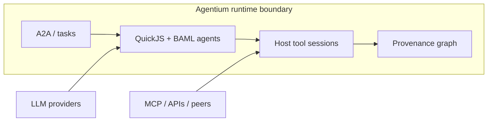

# Agentium OS

Agentium OS is a **deployable agent runtime** for AI systems that take real
actions — tools, MCP servers, other agents, multi-turn tasks — while the **host
stays in control of every effect**. Agents are authored in
[BAML](https://github.com/BoundaryML/baml) and TypeScript, executed in an
embedded QuickJS sandbox, and served over the
[A2A](https://google.github.io/A2A/) protocol. What happened is recorded in a
**graph-native provenance store** you can query after the fact.

---

## The proposition

These are the architectural commitments that define Agentium OS (expanded in
[`docs/assertions/agentium-runtime-thesis.md`](docs/assertions/agentium-runtime-thesis.md)):

**Runtime, not framework.** Agentium is something you **deploy and operate** —
a boundary around planning, execution, A2A, and observability — not a library
you embed and hope agents behave.

**Host-mediated effects.** Tool calls (HTTP, MCP, inter-agent delegation) run in
**Rust on the host** via a session FSM. JavaScript never mediates host tool
execution. If an effect happened, the runtime saw it.

**Declarative agent artefacts.** The shareable unit is a **content-addressable
bundle** (manifest, TypeScript, BAML) executed by the trusted runtime — not an
ad-hoc dependency graph on the agent side.

**Planning and outcomes are runtime concepts.** Tasks, plans, steps, tool-session
phases, citations, and `StructuredReply` are enforced by the platform — not
informal prompt conventions.

**Graph-first provenance.** Conversation context, exports, and drift reads
**traverse edges** in the provenance graph — never string hacks on node IDs or
timestamps. If a relationship matters, it is an edge.

**Cluster continuity.** In multi-runner deployments, router-held conversation
state, shared SurrealDB, and deployment APIs provide operational continuity;
durable truth lives in the graph.



**Authoring and deep references:** [`docs/assertions/how-to-write-agents.md`](docs/assertions/how-to-write-agents.md) · [`docs/README.md`](docs/README.md)

---

## Get running

Commands use [`just`](https://github.com/casey/just) (`just --list` for the full
set). A `.env` / `fnox.toml` in the repo root supplies API keys for LLM tests and
demos — see [`CONTRIBUTING.md`](CONTRIBUTING.md).

### First-time setup

```bash
just check-host          # Linux deps + TypeScript 6 on PATH
just build-release       # baml-agent-builder + baml-agent-runner
```

### Local runner (+ chat UI)

```bash
just web-build           # optional: operator UI at /
just runner              # HTTP A2A on http://127.0.0.1:18080
```

Persist provenance to disk:

```bash
just runner-provenance
```

Publish and deploy agents with `baml-agent-builder` and the runner repository
API — see [`docs/reference/agent-runner.md`](docs/reference/agent-runner.md).

### Example flows (`just`)

| Command | What it does |
|---------|----------------|
| `just notion-demo` | HTTP demo: package + deploy + one Notion agent request (needs `NOTION_API_TOKEN`) |
| `just coordinator-demo` | Coordinator delegates to Notion over A2A |
| `just slack-demo` | Slack todo-extraction demo |
| `just clickup-agent` | Run the ClickUp agent (stdio + HTTP runner) |
| `just list-agents` | List agent packages known to the SDK |
| `just list-tools` | List registered host tools |

Stop background demos: `just notion-demo-stop`, `just coordinator-demo-stop`, etc.

MCP walkthrough (weather agent, no `just` wrapper): [`scripts/meteo_mcp.sh`](scripts/meteo_mcp.sh) — `runner` in one terminal, `chat` in another.

### Kubernetes pilot

End-to-end package validation on a local k3d cluster (Helm + registry + smoke):

```bash
just verify-k8s-pilot-package
```

Operator install path: [`docs/runbooks/k8s-pilot-operator-guide.md`](docs/runbooks/k8s-pilot-operator-guide.md).

### Develop and test

```bash
just fmt
just clippy
just doctor              # workspace integrity (cargo-agent-platform)
just test-unit           # no API keys
just test                # CI-parity nextest (needs OPENROUTER_API_KEY for LLM lane)
```

### Observability (optional)

```bash
just otel-up             # local Prometheus / Tempo / Grafana stack
just otel-summary 15m    # latency snapshot from Prometheus
just otel-down
```

---

## Documentation

| Audience | Start here |
|----------|------------|
| Agent authors | [`docs/assertions/how-to-write-agents.md`](docs/assertions/how-to-write-agents.md) |
| Operators / K8s | [`docs/runbooks/k8s-pilot-operator-guide.md`](docs/runbooks/k8s-pilot-operator-guide.md) |
| Runtime thesis | [`docs/assertions/agentium-runtime-thesis.md`](docs/assertions/agentium-runtime-thesis.md) |
| Full index | [`docs/README.md`](docs/README.md) |
| Contributing | [`CONTRIBUTING.md`](CONTRIBUTING.md) |

## License

Apache License 2.0 — see [`LICENSE`](LICENSE) and [`NOTICE`](NOTICE).
