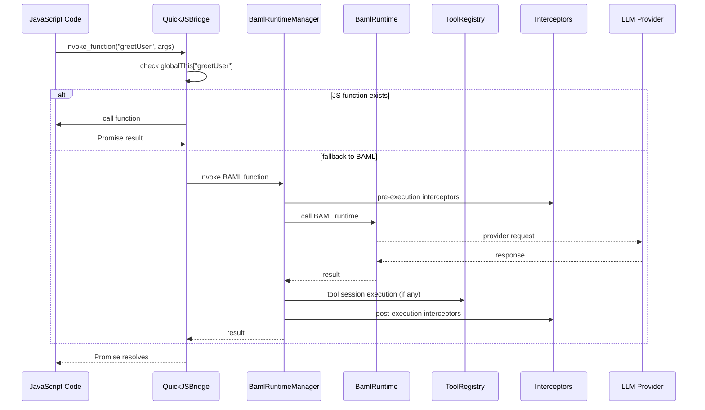
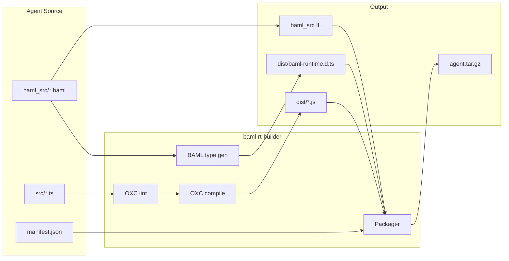

# BAML Runtime

BAML Runtime is a Rust workspace that hosts BAML execution, QuickJS agent
integration, tool systems, and A2A protocol handling. The public entry point is
the `baml-rt` facade crate, which re-exports feature-gated subcrates.

## Workspace Architecture

### Crate Map (Bottom-Up)

- `baml-rt-core`: Core errors/results, correlation helpers, and shared types.
- `baml-rt-id`: Newtype ID wrappers (UUID-based).
- `baml-rt-tools`: Tool traits, registry/executor, and session FSM primitives.
- `baml-rt-interceptor`: Interceptor traits, pipelines, and tracing interceptors.
- `baml-rt-observability`: Tracing setup, spans, and metrics helpers.
- `baml-rt-quickjs`: QuickJS runtime host, schema loading, JS bridge, and context.
- `baml-rt-a2a`: Agent-to-agent protocol types, transport, and request handling.
- `baml-rt-provenance`: Provenance graph + FalkorDB persistence.
- `baml-rt-api`: HTTP API surface (agent discovery, A2A forwarding, OpenAPI).
- `baml-rt-builder`: Agent build pipeline and `baml-agent-builder` CLI.
- `baml-agent-runner`: Binary that loads packaged agents and serves A2A requests.
- `baml-rt`: Facade crate that re-exports the above via feature flags.
- `baml-derive-core`: Core types + rendering for `#[derive(BamlType)]`.
- `baml-derive`: Proc-macro for `#[derive(BamlType)]`.
- `baml-derive-tests`: Integration tests for derive macro (not published).
- `test-support`: Shared fixtures and helper utilities for tests.

### Runtime Flow (QuickJS + BAML)



### Build + Packaging Flow



## Facade Features (`baml-rt`)

The `baml-rt` crate exposes feature-gated modules:

- `tools` → `baml-rt-tools`
- `interceptor` → `baml-rt-interceptor`
- `quickjs` → `baml-rt-quickjs` (implies tools/interceptor/observability)
- `a2a` → `baml-rt-a2a` (depends on `quickjs`)
- `builder` → `baml-rt-builder`
- `observability` → `baml-rt-observability`

Default features enable all of the above.

## BAML ↔ Host Tool Contract

Host tools are **session-based**. BAML returns a declarative `ToolSessionPlan`
that describes FSM steps (`Open`, `Send`, `Next`, `Finish`, `Abort`), and the
runtime executes those steps **in Rust**. JavaScript never mediates host tool
execution; JS only handles JS tools via `invokeTool`.

## Conversation Handling (A2A DSL)

The **best reference** for multi-turn conversation and task lifecycle is the
**task-lifecycle-demo** fixture:

- **Path:** `tests/fixtures/agents/task-lifecycle-demo/src/index.ts`
- **Concepts:** `__chat_register({ run })` with a single `run(ctx)` entrypoint;
  `ctx.text`, `ctx.message`, `ctx.emit` for working messages, artifacts, and
  `await emit.awaitInput(prompt)` to suspend until the next user message.
- **Flow:** Path choice → review loop (approve/reject/revise) → sign-off loop
  (confirm/request-changes/cancel) → COMPLETED. No nested loops; sequential
  phases only.

All fixture agents under `tests/fixtures/agents/` use the same DSL (see
`tests/fixtures/README.md`). Types and runtime are in the generated
`baml-runtime.d.ts`; there is no separate `a2a.ts`.

## Binaries

- `baml-agent-builder` (from `baml-rt-builder`): Lint, compile, and package agents.
- `baml-agent-runner` (from `baml-agent-runner`): Load packaged agents and serve A2A.

## Repository Layout

```text
baml-rt/
├── crates/
├── baml_src/                    # Example BAML schemas
├── tests/fixtures/agents/       # Example/demo agents (task-lifecycle-demo, stream-*, etc.)
└── tests/                       # Workspace-level tests and fixtures
```

## Testing

Source `.env` before running tests so API-key–dependent e2e and contract tests pass (e.g. `OPENROUTER_API_KEY`):

```bash
set -a && source .env && set +a
cargo test
# Note: this runs only workspace `default-members` now. To run everything:
# cargo test --workspace

# With output
cargo test -- --nocapture
```

## License

[License information]
