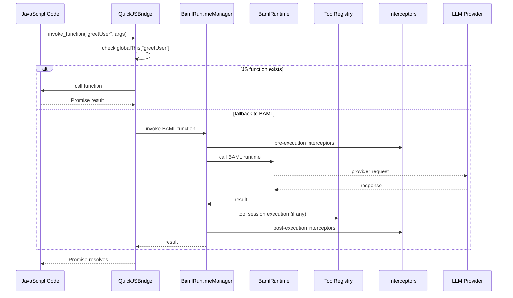
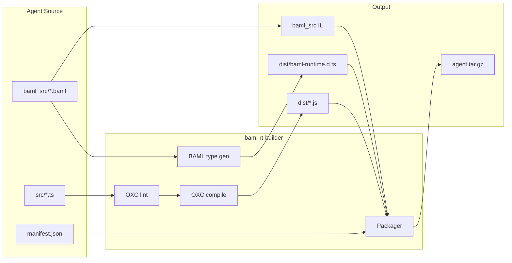

# Agentium OS

Agentium OS is a Rust workspace that hosts BAML execution, QuickJS agent
integration, tool systems, and A2A protocol handling. The public entry point is
the `baml-rt` facade crate, which re-exports feature-gated subcrates.

## Workspace Architecture

### Crate Map (Bottom-Up)

- `baml-rt-core`: Core errors/results, correlation helpers, stream boundary types, and effect-bus primitives.
- `baml-rt-tools`: Tool traits, registry/executor, and session FSM primitives.
- `baml-rt-interceptor`: Interceptor traits, pipelines, and tracing interceptors.
- `baml-rt-observability`: Tracing setup, spans, and metrics helpers.
- `baml-rt-quickjs`: QuickJS runtime host, schema loading, JS bridge, and async stream execution.
- `baml-rt-a2a`: Agent-to-agent protocol types, stream-first transport, and cross-turn request handling.
- `baml-rt-provenance`: Graph-native provenance normalization, persistence, and export (SurrealDB-backed).
- `baml-rt-builder`: Agent build pipeline and `baml-agent-builder` CLI.
- `baml-agent-runner`: Binary that loads packaged agents and serves A2A requests.
- `baml-rt`: Facade crate that re-exports the above via feature flags.
- `test-support`: Shared fixtures and helper utilities for tests.

### Provenance Architecture (Corrected)

- In SurrealDB mode, runtime wiring uses a **single concrete provenance store** projected into narrow trait interfaces for A2A/task/context/provenance needs.
- Task/message/status/artifact writes and provenance events share the same underlying persistence instance (no split concrete stores).
- Conversation context and Mermaid sequence exports are graph-backed reads from persisted provenance data.

### Runtime Flow (QuickJS + BAML)



### Build + Packaging Flow



## Facade Features (`baml-rt`)

The `baml-rt` crate exposes feature-gated modules:

- `tools` → `baml-rt-tools`
- `interceptor` → `baml-rt-interceptor`
- `quickjs` → `baml-rt-quickjs` (implies tools/interceptor/observability)
- `a2a` → `baml-rt-a2a` (depends on `quickjs`)
- `builder` → `baml-rt-builder`
- `observability` → `baml-rt-observability`

Default features enable all of the above.

## Documentation

- **[How to write agents](docs/how-to-write-agents.md)** — Primary guide: package layout, A2A entrypoints, `ToolSessionPlan`, plan/intent + ReAct, `StructuredReply`, and **history / citations**.
- **[Agent runner](docs/agent-runner.md)** — Runner CLI options, HTTP endpoints, repository/deploy flow, and startup restore behavior.
- **Deep references:** [Intent-based planning & session prompting](docs/intent-based-planning-and-session-prompting.md), [Agent patterns](docs/agent-patterns.md), [Host tool guide (Rust)](docs/host-tool-guide.md), [Citable history & citations](docs/citable-history-and-checked-citations.md).

## BAML ↔ Host Tool Contract

Host tools are **session-based**. BAML returns a declarative session **fragment**
(typically `step` + `op`, or a flat `op` object) with `Open`, `Send`, `Read`,
`Finish`, `Abort`; the runtime executes each fragment **in Rust**. JavaScript
does not mediate host tool execution except via generated helpers such as
`openToolSession`; JS-only tools use `invokeTool`. Authoring details:
[docs/how-to-write-agents.md](docs/how-to-write-agents.md) §3.

`Open.initial_input` is open-time session configuration (for tools that define
it). `Send.input` carries per-turn payloads.

## Promise polling and effect-gated timeout

When `evaluate()` runs non-stream code that returns a promise, the host polls until
the promise resolves or a timeout. The timeout is **effect-gated** and **deterministic**:
the first timeout sample is taken only after one run of pending jobs (so the promise
executor has had a chance to emit effects); then the effect state is re-checked on a
fixed schedule (every 10 attempts for the first 500ms, then every 100). If
in-flight effects (e.g. LLM or tool calls) are present for the invocation context,
a long timeout is used; otherwise a short idle timeout applies. See
`crates/baml-rt-quickjs/docs/HOST_QUICKJS_STREAM_INVARIANTS.md` and
`crates/baml-rt-quickjs/src/quickjs_bridge/promise_polling.rs`.

**Potential problem:** The Rust future that backs the JS promise (e.g. the BAML/LLM
call) only runs when the QuickJS event loop runs pending jobs. On slow or busy CI,
that can happen well after the first timeout sample, so the poll loop may see no
effects and use the short idle timeout (e.g. 5s), causing “Promise did not resolve
after 5000 attempts”. To mitigate this, the first 2 seconds of polling never use
the short timeout (warm-up window). To isolate locally, run with
`RUST_LOG=baml_rt_quickjs=trace` and check for “LlmStarted emitting” vs
“poll_promise: effect-gated timeout sample” timing (see `crates/baml-rt/tests/llm_test.rs`).

## Observability (OTEL) Quickstart

This repo ships a local telemetry stack under `observability/`:

- OpenTelemetry Collector (OTLP ingest)
- Prometheus (metrics store)
- Tempo (trace store)
- Grafana (dashboards)

### Start/stop the stack

```bash
just otel-up
just otel-ps
just otel-logs
just otel-summary 15m
just otel-down
```

- `otel-up/down/ps/logs` call `scripts/otel-stack.sh`.
- `otel-summary <window>` prints a Prometheus text summary (e.g. top LLM/tool latency consumers). Example: `just otel-summary 15m`.

### Runner defaults and behavior

`just runner` and `just runner-provenance` now set OTEL defaults automatically (unless already set in your shell or `.env`):

- `OTEL_TRACES_EXPORTER=otlp`
- `OTEL_METRICS_EXPORTER=otlp`
- `OTEL_EXPORTER_OTLP_PROTOCOL=grpc`
- `OTEL_EXPORTER_OTLP_ENDPOINT=http://localhost:4317`
- `OTEL_SERVICE_NAME=baml-agent-runner`

They also auto-start the local OTEL docker stack by default (`OTEL_AUTO_UP=1`).
Disable this with:

```bash
OTEL_AUTO_UP=0 just runner
```

Because telemetry is emitted from runtime/runner code, any agent package running inside the runner contributes metrics/traces (including multiple agents concurrently).

### Initial Grafana setup

After `just otel-up`:

- Grafana: `http://localhost:3000` (`admin` / `admin`)
- Prometheus: `http://localhost:9090`

A provisioned dashboard is included:

- **Agent Platform / Agent Platform Overview** (`observability/grafana/dashboards/agent-platform-overview.json`)

### Currently exported metrics (key set)

OTEL instrument names (before Prometheus normalization) include:

- `baml_rt.a2a.request_total`
- `baml_rt.a2a.request_duration_ms`
- `baml_rt.a2a.error_total`
- `baml_rt.tool.invocation_total`
- `baml_rt.tool.invocation_duration_ms`
- `baml_rt.quickjs.invoke_total`
- `baml_rt.quickjs.invoke_duration_ms`
- `baml_rt.llm.call_total`
- `baml_rt.llm.call_duration_ms`
- `baml_rt.llm.prompt_bytes`
- `baml_rt.llm.tokens_in_total`
- `baml_rt.llm.tokens_out_total`

(Collector/Prometheus will expose normalized names with `_` separators.)

### Tracing defaults (`RUST_LOG`)

Binaries that call `baml_rt_observability::init_tracing()` merge defaults such as
`baml_rt=info`, **`baml_rt_quickjs=info`**, and `baml_agent_runner=info` with
`RUST_LOG` from the environment.

- **`RUST_LOG=error`** — only `ERROR` events; `WARN` diagnostics (e.g. some
  pre-change paths) are hidden. Use **`error` or explicit crate targets** when
  debugging “silent” tool/BAML failures.
- **`RUST_LOG=baml_rt_quickjs=error,baml_rt=info`** — ERROR+ from the QuickJS/BAML
  bridge while keeping other `baml_rt*` namespaces at info.
- **`RUST_LOG=baml_rt_quickjs=trace`** — verbose bridge tracing (high volume).

## Conversation Handling (A2A DSL)

See **[How to write agents](docs/how-to-write-agents.md)** for the full authoring story. The **best reference** for multi-turn conversation and task lifecycle in code is the
**task-lifecycle-demo** fixture:

- **Path:** `tests/fixtures/agents/task-lifecycle-demo/src/index.ts`
- **Concepts:** `__chat_register({ run })` with a single `run(ctx)` entrypoint;
  `ctx.text`, `ctx.message`, `ctx.emit` for working messages, artifacts, and
  `await emit.awaitInput(prompt)` to suspend until the next user message.
- **Flow:** Path choice → review loop (approve/reject/revise) → sign-off loop
  (confirm/request-changes/cancel) → COMPLETED. No nested loops; sequential
  phases only.

All fixture agents under `tests/fixtures/agents/` use the same DSL (see
`tests/fixtures/README.md`). Types and runtime are in the generated
`baml-runtime.d.ts`; there is no separate `a2a.ts`.

## Binaries

- `baml-agent-builder` (from `baml-rt-builder`): Lint, compile, and package agents.
- `baml-agent-runner` (from `baml-agent-runner`): Load packaged agents and serve A2A.

## Repository Layout

```text
baml-rt/
├── crates/
├── baml_src/                    # Example BAML schemas
├── tests/fixtures/agents/       # Example/demo agents (task-lifecycle-demo, stream-*, etc.)
└── tests/                       # Workspace-level tests and fixtures
```

## Development Commands (justfile)

The project uses [just](https://github.com/casey/just) as a command runner. A `.env` file is loaded automatically (`set dotenv-load`). Run `just --list` to see all available recipes.

| Recipe | Usage | Description |
|---|---|---|
| `just fmt` | `just fmt` | Run `cargo fmt --all` to format the entire workspace. |
| `just test` | `just test` | Full nextest suite with CI-parity feature flags. Requires `cargo-nextest` and `OPENROUTER_API_KEY` for LLM tests. |
| `just test-build` | `just test-build` | Compile-only (no execution) — useful as a quick pre-push sanity check. |
| `just test-crate <crate>` | `just test-crate baml-rt-provenance` | Run tests for a single crate with the same CI feature flags. |
| `just test-unit` | `just test-unit` | Run only unit tests that need neither FalkorDB nor API keys. |
| `just clickup-agent` | `just clickup-agent` | Build and run the ClickUp agent: packages it via `baml-agent-builder` then launches the runner in A2A stdio mode. Uses in-memory provenance (embedded SurrealDB) by default. |
| `just clickup-agent-provenance` | `just clickup-agent-provenance` | Same as `clickup-agent`, but persists provenance to `provenance.db` and exposes HTTP API endpoints (including Mermaid and context metrics). |
| `just notion-agent` | `just notion-agent` | Build and run the Notion agent in A2A stdio mode (HTTP tools enabled). Uses in-memory provenance by default. |
| `just notion-agent-provenance` | `just notion-agent-provenance` | Same as `notion-agent`, but persists provenance to `provenance.db`. |
| `just slack-agent` | `just slack-agent` | Build and run the Slack todo-extraction agent in A2A stdio mode (read-only Slack tool). |
| `just slack-agent-provenance` | `just slack-agent-provenance` | Same as `slack-agent`, but persists provenance to `provenance.db`. |
| `just coordinator-agent` | `just coordinator-agent` | Build and run `coordinator-agent` with `notion-agent` loaded so delegation via `system/internal_a2a` works in stdio mode. |
| `just coordinator-agent-provenance` | `just coordinator-agent-provenance` | Same as `coordinator-agent`, but persists provenance to `provenance.db`. |
| `just notion-demo` | `just notion-demo` | Start the Notion HTTP demo runner and stream one request; writes SSE output and captures context/task IDs when present. |
| `just notion-demo-stop` | `just notion-demo-stop` | Stop the background runner started by `notion-demo`. |
| `just slack-demo` | `just slack-demo` | Start the Slack HTTP demo runner and stream one todo-extraction request. |
| `just slack-demo-stop` | `just slack-demo-stop` | Stop the background runner started by `slack-demo`. |
| `just coordinator-demo` | `just coordinator-demo` | Start coordinator + notion HTTP demo runner and stream one coordinated request via `coordinator-agent`. |
| `just coordinator-demo-stop` | `just coordinator-demo-stop` | Stop the background runner started by `coordinator-demo`. |
| `just provenance-mermaid <context_id>` | `just provenance-mermaid ctx-1771426017780-2` | Export a simplified Mermaid sequence diagram for a given provenance context ID. |

For a provenance-first walkthrough of the Notion flow, see `docs/notion-demo.md`.
For Slack auth/setup and demo notes, see `docs/slack-tool.md`.
For the coordinator + Notion delegation walkthrough, see `docs/coordinator-demo.md`.
For the next-stage Notion demo/UX strategy and invariants, see `docs/notion-experience-blueprint.md`.

### Performance benches

Criterion benches are available for targeted local perf checks (no network required unless your bench logic adds it):

```bash
# Provenance sequence-diagram rendering benchmarks
cargo bench -p baml-rt-provenance --bench sequence_render

# Provenance LlmCompleted drift-path benchmark (local mock provider)
cargo bench -p baml-rt-provenance --bench drift_llm_completed
```

Notes:
- First run can take longer due to build and warm-up.
- If you see old comparison output, Criterion is comparing against a previous baseline in `target/criterion`.

### CI feature flags

The `test`, `test-build`, and `test-crate` recipes enable the following features to match CI:

```text
baml-rt-builder/http-tools, baml-agent-runner/http-tools, baml-agent-runner/memory,
baml-rt/llm-tests, baml-agent-runner/llm-tests
```

## Testing

Source `.env` before running tests so API-key–dependent e2e and contract tests pass (e.g. `OPENROUTER_API_KEY`):

```bash
set -a && source .env && set +a
cargo test
# Note: this runs only workspace `default-members` now. To run everything:
# cargo test --workspace

# With output
cargo test -- --nocapture
```

**Slow tests / pre-effect timeout:** Contract and LLM-dependent tests (e.g. `contracts_test::test_js_function_invocation_returns_actual_result`) can be slow or fail because they hit the **short (idle) timeout before any LLM effect is observed**: the promise executor may not run soon enough, so the poll loop never sees `LlmStarted` and uses the idle timeout (e.g. 5s default or 45s if configured). That can cause 60s+ wall time (e.g. multiple timeouts or one long idle limit) or failure with "Promise did not resolve after N attempts". The warm-up window (first 2s never use the short timeout) and effect wiring (see "Promise polling and effect-gated timeout" above) mitigate this; ensure tests that call BAML/LLM use a QuickJS config with long enough timeouts and wire `set_effect_liveness`. Running with `cargo test --release` reduces CPU-bound time but does not fix the pre-effect timeout issue. CI uses nextest with the `llm` test group limited to 2 threads.

## License

[License information]
