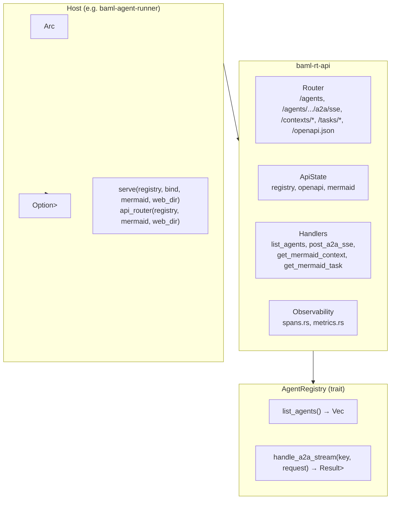

# baml-rt-api

HTTP API surface for BAML agent **discovery** and **A2A (Agent-to-Agent)** JSON-RPC forwarding. Used by the runner when started with `--serve-http`; can be embedded in any host that implements `AgentRegistry`.

---

## Architecture



### Module Layout

|Module|Role|
|---|---|
|`router`|Builds Axum `Router`, `ApiState`, and `serve()` entrypoint.|
|`handlers`|HTTP handlers: discovery and A2A (POST + SSE).|
|`openapi`|DTOs and utoipa types for OpenAPI spec.|
|`spans`|OTel span helpers (orthogonal to handlers).|
|`metrics`|OTel request counters/histograms (OnceLock-cached).|

---

## Routes

|Method|Path|Description|
|---|---|---|
|**GET**|`/agents`|List running agents. Returns JSON array of `{ agent_package, agent_instance_id, name, version }`.|
|**POST**|`/agents/{agent_package}/{agent_instance_id}/a2a/sse`|A2A JSON-RPC request. Body: single JSON-RPC 2.0 object. Response is **Server-Sent Events** (`text/event-stream`) streamed directly from `BusStream`. One event per JSON-RPC response; 15s keep-alive.|
|**GET**|`/contexts/{context_id}/mermaid`|Mermaid sequence diagram for a provenance context (when Mermaid service is configured).|
|**GET**|`/tasks/{task_id}/mermaid`|Mermaid sequence diagram for a provenance task (when Mermaid service is configured).|
|**GET**|`/contexts/{context_id}/metrics`|Context token/call metrics (when ContextMetrics service is configured).|
|**GET**|`/openapi.json`|OpenAPI 3.x spec for the above (generated by utoipa).|

### Path Parameters

- `agent_package`: Agent package id (e.g. manifest name such as `stream-baml-tool`).
- `agent_instance_id`: Instance id (e.g. `default`).

### A2A Body (POST)

Single JSON-RPC 2.0 request, e.g.:

```json
{ "jsonrpc": "2.0", "method": "tasks.list", "params": {}, "id": null }
```

Supported methods include `tasks.list`, `tasks.get`, `tasks.subscribe`, `message.sendStream`. Use `id: null` to let the server assign a correlation id.

### Streaming Boundary

- `AgentRegistry` is stream-first: `handle_a2a_stream(...) -> BusStream<Value>`.
- `/a2a/sse` forwards stream items directly as SSE events.

### Errors

4xx/5xx responses use RFC 7807 Problem Details (`http-api-problem`). Typical: 400 (malformed body), 404 (agent not found), 500 (internal/server error).

---

## Usage

**Run a full server** (bind and block):

```rust
use baml_rt_api::serve;
use std::sync::Arc;

let registry: Arc<dyn AgentRegistry> = Arc::new(my_registry);
serve(registry, "127.0.0.1:18080", None, None).await?;
```

**Use only the router** (e.g. to mount under a prefix or add middleware):

```rust
use baml_rt_api::{api_router, ApiState};
use std::sync::Arc;

let registry: Arc<dyn AgentRegistry> = Arc::new(my_registry);
let app = api_router(registry, None, None);
// axum::serve(listener, app).await?;
```

---
