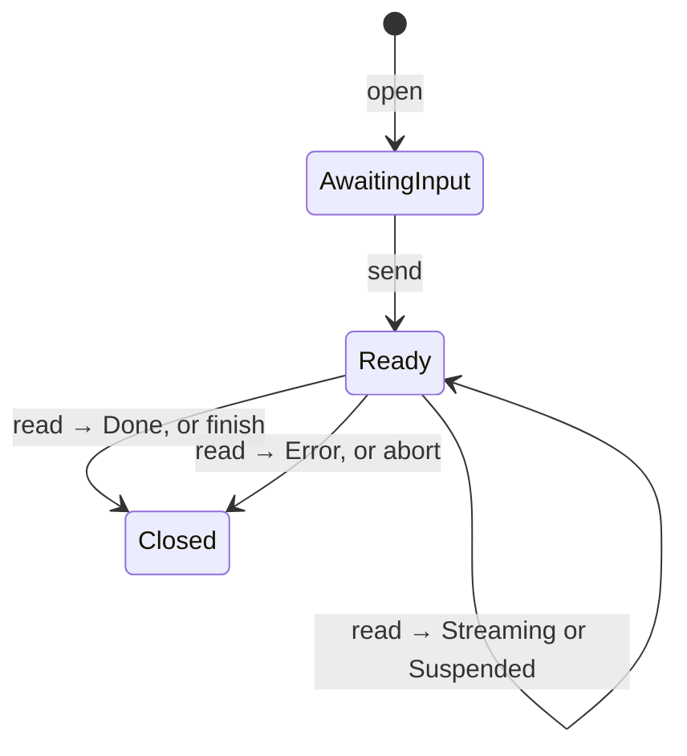

# baml-rt-tools

**Tool system primitives** for the Agentium OS workspace: naming, metadata, session FSMs, schema/codegen hooks, error classification, and prompt projection inputs.

This crate defines **contracts** between BAML/LLM session plans and host integrations. Runtimes (`baml-rt-quickjs`, runners, API) **execute** those contracts; vendor tools **implement** `ToolHandler` / `BamlTool`.

## Responsibilities (quick map)

- **`BamlTool` / `ToolHandler`** — registration, schemas, execution or `open_session`.
- **`ToolRegistry`** — lookup, allowlists, config, live **`ToolSession`** map (`ToolSessionId`).
- **`tool_fsm`** — `ToolSession` trait, `ToolStep`, `ToolFailure`, session phase.
- **`tools::ToolSessionHandle`** — typestate Open → Send → Read → Finish/Abort.
- **`SessionPolicy`** — Strict vs MultiSend scheduling for the step executor.
- **`tool_schema`** — `ToolType`, JSON Schema + TS, **`DescribeAction`**.
- **`tool_error_classify`** — `ClassifiedToolError`, host retry vs LLM-correctable.
- **`prompt_projection`** — `conversation_history` from provenance + registry.
- **`tool_discovery`** — deterministic ranked `search_tools`.
- **`session_coordination`** — inventory providers for session BAML fragments.

---

## Intent: what “tool execution” means here

| Layer | Responsibility |
|-------|----------------|
| **Plan (BAML)** | Emits steps: Open / Send / Read / Finish / Abort with JSON payloads. |
| **Registry** | Resolves tool name → metadata + handler; owns sessions by id. |
| **Session FSM** | `ToolSession::send` / `read` / `finish` / `abort` — the authoritative state machine. |
| **Narrowing** | **`OpenInput`** (open) vs **`Input`** (send) vs **`Output`** (result) are **different Rust types** → different JSON schemas for each phase. |
| **Errors** | `ToolSessionError` → `ToolFailure` + **`ClassifiedToolError`** for LLM-visible JSON and retry policy. |

---

## Session FSM

### Plan operations (typical session tool)

1. **Open** — `initial_input: OpenInput`; creates session, validates scope/config.
2. **Send** — `input: Input`; submits work or parameters for the next read.
3. **Read** — host supplies read controls; handler returns **`ToolStep`**.
4. **Finish** / **Abort** — release session and provenance linkage.

One-shot tools often use `OpenInput = ()` and a single Send/Read pair.

### `ToolSession` (`tool_fsm.rs`)

Async trait implemented by the session backend:

- **`send(input)`** — accept Send-phase JSON.
- **`read(input)`** — return **`ToolStep`**.
- **`finish` / `abort`** — lifecycle cleanup.

### `ToolStep` variants

| Variant | Session | Meaning |
|---------|---------|---------|
| `Streaming { output }` | Open | More chunks may follow. |
| `Suspended { output }` | Open | Partial; e.g. input required — **do not** finish yet. |
| `Done { output }` | Closing | Success; registry may auto-finish. |
| `Error { error }` | Closing | **`ToolFailure`** with classified payload. |

### `ToolSessionHandle<State>` (`tools.rs`)

Typestate encoding:

- **`AwaitingInput`** — after `open`; may **`send`**.
- **`Ready`** — after `send`; may **`read`**, **`finish`**, **`abort`**.
- **`Closed`** — terminal.

**`read`** returns **`ToolSessionAdvance`** (`Streaming`, `Suspended`, `Done`, `Error`). On terminal steps, the registry invokes **`finish`** or **`abort`** as appropriate.

**Drop:** non-`Closed` drops spawn **`abort`** on the current runtime (best-effort).

---

## `SessionPolicy`: Strict vs MultiSend

Defined on **`ToolFunctionMetadata.session_policy`** (manifest/builder), **not** by guessing from function names. Default: **`Strict`**.

| Policy | Executor behaviour |
|--------|-------------------|
| **Strict** | After **Send**, only **Read** is offered until pending input is consumed — avoids “session already has input” when the model double-Sends. |
| **MultiSend** | Multiple **Send**s per open session before read (e.g. search then fetch). Opt-in on `BamlTool::SESSION_POLICY` and metadata builder. |

---

## Schema narrowing (`tool_schema.rs`)

**Narrowing** = **phase-specific types**, not dynamic JSON Schema patching.

- **`OpenInput`** — `open_input_schema`, validated with **`validate_open_input`** (`{}` / `null` OK for `()`).
- **`Input`** — `input_schema` for Send; must implement **`DescribeAction`** for drift / summaries.
- **`Output`** — `output_schema` for results.

**`ToolType`** = `JsonSchema + ts_rs::TS`. Helpers: **`json_schema_value`**, **`ts_decl`**, **`ts_name`**.

Session helpers such as **`create_multi_send_session_tool_from_async`** wire **OI / I / O** explicitly.

---

## `DescribeAction` & `prompt_projection`

- **`DescribeAction::describe`** — natural-language line for **Open** and **Send** payloads (drift scoring, context).
- **`prompt_projection`** — builds `conversation_history` for `ctx.tags`; **ToolCall** text uses registry **`describe_invocation`**, which often deserializes step JSON and calls **`DescribeAction`** on typed inputs.

---

## Error handling (`tool_error_classify.rs` + `tools.rs`)

1. **`BamlRtError`** — core transport/JS/validation errors.
2. **`ToolSessionError::Transport`** or **`::Tool(ToolFailure)`**.
3. **`ToolFailure`** — `kind`, `retryability`, **`classified: ClassifiedToolError`**.
4. **`ClassifiedToolError`** — `code`, **`disposition`**, `message`, optional `hint`, `retry_after_ms`; **`to_tool_error_json`** for BAML/tool payloads.

**`ErrorDisposition`** (`baml_rt_core::semantics`):

| Disposition | Host retry w/o new LLM turn? |
|-------------|------------------------------|
| `HostRetriable` | Yes |
| `LlmCorrectable` | No — fix args |
| `InformAndContinue` | No — inform model (e.g. auth) |
| `Fatal` | No |

Default: **`ClassifiedToolError::from_baml_error`**. Override per session: **`ToolExecutionClassifier`** + **`classify_for_session`** / **`ToolFailure::from_error_in_session`**.

Helpers: **`should_host_retry`**, **`should_host_retry_baml_error`**, **`a2a_retryability`**.

`map_session_error` embeds `tool_error` + `failure_kind` into **`BamlRtError::ToolExecution`** for unified handling upstream.

---

## Supporting modules

| Module | Role |
|--------|------|
| `tool_discovery` | `search_tools` — deterministic ranking. |
| `tool_catalog` / `bundles` | Inventory, manifest names, bundle metadata. |
| `host_registration` | `register_manifest_tools`. |
| `access` | Allowlists / access policy. |
| `config_resolver` | Per-bundle tool config. |
| `archive_read` / `archive_refs` | Large results → archives + cat-n. |
| `ts_gen` | TS emission for tools. |

---

## Debugging

Set **`BAML_TRACE_TOOL_SESSION`** for registry stderr traces (`tool_registry_trace` in `tools.rs`).

## LLM JSON boundary (tool Send payloads)

LLM-emitted JSON often uses **PascalCase** enum strings where Rust uses **`serde(rename_all = "snake_case")`**, which breaks **`untagged`** tool inputs unless the host tolerates both shapes. **Prompts help; serde aliases (or equivalent) are the durable fix.**

Future work: centralised derive helpers, optional normalise pass, schema-driven contract tests. See **[`docs/llm_json_boundary.md`](docs/llm_json_boundary.md)**.

## See also

- [`src/lib.rs`](src/lib.rs) — public exports.
- `baml-rt-core` — `BamlRtError`, `ErrorDisposition`, provenance IDs.
- `baml-rt-quickjs` — plan extraction and step execution.
