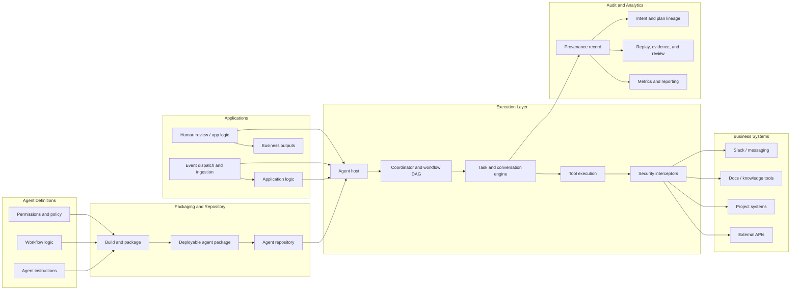

# System Architecture

Agentium OS is an infrastructure layer for deploying AI agents that can do
real work inside business systems while remaining observable, governable, and
auditable. The platform is designed around a simple but important principle:
models may decide what they want to do, but the platform decides how those
actions are executed, controlled, recorded, and resumed.

This distinction matters commercially. Many AI products can produce impressive
one-shot answers. Far fewer can support long-running work, multi-step task
execution, cross-system coordination, and enterprise accountability. The role
of Agentium OS is to turn AI from a conversational feature into an
operational system.

A critical part of that operating model is provenance: the platform maintains a
replayable record of how work moved from request to decision to action to
result. That record is not an afterthought. It is what makes the system
enterprise-ready, because operators and customers can inspect what happened
instead of taking the model's output on faith.

Three design principles shape the architecture.

1. AI capability sits inside operational controls.
   The platform does not rely on model behavior alone. It wraps model output in
   explicit execution rules, task lifecycles, and system boundaries.

2. Real-time execution is the primary product surface.
   Agents are designed to work through live, resumable interactions rather than
   only through single request-response exchanges.

3. Traceability is part of the core product.
   Every important step in an agent workflow can be reconstructed later: who
   asked, what the agent did, which tools were used, what evidence was
   produced, and what state changed.

Figure 1 sketches the architecture across the major layers.

## Overview

The platform has two main entry paths.

The first is the hosted-agent path. An agent is defined, packaged, deployed to
the host, and then exposed through live task-oriented interfaces. Requests can
be streamed, paused, resumed, and inspected as the agent works.

The second is the orchestration path. External project signals such as team
discussion or workflow events are interpreted into structured work items and
dispatched into the runtime. What happens next may be handled by the hosted
agent itself, by application-specific logic built on top of the runtime, or by
human review when needed. The platform is designed to support these different
operating models without hard-coding one orchestration pattern into the core.

Across both paths, the goal is the same: make AI work like an accountable
operating process rather than an isolated chatbot interaction. In both cases,
the platform is designed to leave behind a structured provenance trail so that
the output is not only useful, but explainable and reviewable.

## Agent Authoring, Packaging, and Repository

Agents are created from three kinds of inputs:

- business and domain instructions
- workflow logic
- capability and access policy

These inputs are compiled into a deployable package. Packaging serves two
business purposes.

First, it creates portability. An agent can be versioned, moved between
environments, and loaded into a host without re-assembling it manually.

Second, it creates control. Permissions, expected interfaces, and operational
assumptions are defined before the agent runs, not improvised later in
production.

The platform includes a content-addressable agent repository. Each agent
package is identified by a canonical hash of its authored source content, so
identical source always produces an identical identity regardless of when or
where it was built. The repository stores packages alongside structured
metadata: version history, fitness scores, tags, and full-text search over
source content.

The repository also maintains a lineage graph. When an agent is derived from
another, that relationship is recorded as a typed edge with a rationale. Two
edge kinds exist: direct derivation and softer influence references. This
lineage is useful for understanding how agents evolved and, over time, for
supporting automated agent improvement workflows where the system itself can
propose, test, and score agent variants.

This layer is the construction and distribution phase of the system. It ensures
the runtime is starting from a prepared, versioned, and traceable product
artifact rather than from an unstructured bundle of prompts and scripts.

## Runtime Execution Layer

The execution layer is where model-driven intent becomes governed action. It is
responsible for:

- receiving agent requests
- deciding what needs to be executed
- coordinating tool use across multiple specialist agents
- tracking task state
- preserving the context needed for multi-step work
- isolating each agent's context in multi-agent tasks

The core product insight is that the platform does not let the model directly
"own" execution. Instead, the model proposes actions and the runtime translates
those proposals into controlled operations. This creates a stronger reliability
story than systems that treat tool use as free-form text generation.

Multi-agent coordination is handled by a workflow coordinator that decomposes
requests into dependency-aware plans, validates them as directed acyclic graphs,
and executes them in topological waves. Each wave can delegate to multiple
specialist agents concurrently. Intermediate results flow between plan steps
through artifact interpolation, so downstream agents receive upstream findings
as part of their prompts. The coordinator can fan out work to multiple instances
of the same specialist in parallel and synthesize the results.

Each agent in a multi-agent task sees only its own conversation history. The
runtime manages this through a context projection pipeline that filters,
deduplicates, and budgets the conversation state before each agent invocation.
This isolation is enforced by the platform, not by agent code, so every agent
benefits from it automatically.

The runtime is designed for long-running work. Agent tasks can span multiple
steps, request outside input, produce intermediate artifacts, and continue
later without losing their place. This is important for real operational use,
where business processes do not fit neatly into a single chat turn.

The runtime also manages execution quality under variable conditions. Slow tools
or delayed model responses are treated as normal operating conditions rather
than immediate failure states, which makes the host more resilient in practice.

## Tool and Integration Layer

The tool layer connects agents to the systems where useful work happens. These
may include communication tools, knowledge systems, project management systems,
or custom business APIs.

This layer is important not only for capability, but for product discipline.
The platform distinguishes between:

- safe, read-oriented access used for retrieval and grounding
- controlled write actions that can affect external systems
- multi-step integrations that require durable session handling

In commercial terms, this means the platform can support both low-risk use
cases such as summarization and high-value use cases such as workflow execution
without treating them as the same class of action.

The integration layer is also designed to support specialization. One agent may
be optimized for document analysis, another for project coordination, and
another for cross-system routing. This allows the platform to support
delegation-based product experiences instead of forcing every task through one
general-purpose assistant.

Adding a new tool to the platform is straightforward. The system provides a
declarative registration mechanism that handles metadata generation, schema
publication, and runtime wiring from a single declaration. This lowers the cost
of expanding into new business systems and makes it practical for partners or
customers to contribute domain-specific integrations.

## Task, Conversation, and Hosting Layer

The hosting layer exposes agents as live, task-oriented services rather than as
stateless endpoints. It manages:

- task creation and progress
- live event streaming
- resumable conversations
- intermediate outputs such as messages, status changes, and artifacts

This matters because enterprise workflows are usually interrupted, reviewed, or
continued later. A useful agent platform therefore needs the equivalent of a
task engine, not just a response engine.

The system is built around stream-first execution. As an agent works, the host
can emit progress in real time rather than waiting to assemble a single final
answer. This improves user trust, enables oversight, and makes it possible to
coordinate multiple systems while work is still in progress.

The same host can support direct user-facing interactions, internal agent-to-
agent delegation, and backend workflow execution. That reuse is strategically
important because it turns one runtime into multiple product surfaces.

## Provenance, Traceability, and Persistence Layer

The persistence layer records what happened during execution in a form that can
be queried later. This is more than logging.

The right way to think about this layer is as an evidence system for AI-driven
work. Every meaningful step in the lifecycle can be linked together:

- the original request
- the agent's intermediate decisions
- the tools or systems it touched
- the outputs or artifacts it produced
- the final business result

This is provenance: a structured execution record of what was asked, what the
agent did, which systems it touched, and what happened next. Over time, it
becomes agentic institutional memory: a durable record of how AI-driven work
was carried out, why decisions were made, and what the organization learned.

The platform stores a unified execution record covering:

- requests and responses
- task-state changes
- tool usage
- generated artifacts
- the agent's planning intent and the reasoning behind each step
- how plans evolved when the agent re-planned after new information
- relationships between all of the above

The provenance model captures not only what the agent did, but why. When a
coordinator agent decides to delegate work to specialists, the system records
the intent behind that decision, the plan it produced, and the status of each
step. If the agent re-plans after receiving a clarification or encountering
a failure, the previous plan is preserved and linked to the new one with an
explicit supersession edge. This creates a versioned history of the agent's
reasoning, not just its actions.

The commercial value of this layer is high.

1. Governance.
   Teams can review why an agent took a particular action.

2. Debugging.
   Operators can replay or inspect failed flows without guessing what happened
   in the middle.

3. Product analytics.
   The business can measure throughput, latency, quality, and failure patterns
   across workflows.

4. Trust.
   Customers can see that the platform is not a black box; it produces a
   defensible evidence trail.

5. Demonstrability.
   Sales, solution engineering, and customer success teams can show not just
   that the system reached an answer, but how it reached it.

6. Product leverage.
   The same provenance layer can support audit views, replay tools, operational
   dashboards, quality evaluation, and workflow optimization without rebuilding
   instrumentation for each feature.

This unified execution record also becomes the basis for visualization and
reporting. The same system can support simple metrics, timeline views, and more
advanced replay surfaces for audits, demos, and post-incident review.

This is one of the platform's strongest differentiators. Many agent products can
claim automation. Far fewer can offer automation with proof. Provenance is what
allows Agentium OS to move from "the model says it worked" to "the system
can show its work."

## Orchestration and Application Layer

Above the runtime sit application-specific layers that adapt the platform to a
business context. These may include specialist agents, product logic, human
review surfaces, or other orchestration components. The key architectural point
is not that there must be a single controlling application. It is that
business logic can be composed above the runtime instead of being baked into
the host itself.

Event dispatch is a separate concern. The platform includes a task daemon that
watches external business systems and converts activity into structured work
items. It currently supports project management systems and team messaging
channels as event sources, with configurable routing to determine which sources
feed which downstream handlers. Outputs can be directed to the agent runtime
for autonomous processing, to issue trackers for human triage, or to both.

The daemon is a stateful event processor, not a simple poller. It tracks
cursors for incremental reads, deduplicates derived tasks, diffs snapshots to
detect lifecycle events, and persists state only after successful delivery.
This provides at-least-once delivery guarantees and makes the ingestion pipeline
resumable after failures.

The separation between ingestion and processing is deliberate. The daemon
translates external signals into a typed contract. The decision about what to do
with those signals then lives in agents, application logic, or human workflows
as appropriate.

This separation is strategically useful because it keeps the core platform
general. The same runtime can support:

- direct agent hosting
- application-specific execution flows
- broader operational automation across business systems

In other words, the platform is not limited to answering questions. It provides
the execution layer on which different products and workflow patterns can be
built.

## Security and Governance

Autonomous agents that interact with business systems need more than access
controls. They need runtime defenses against adversarial conditions, especially
prompt injection — cases where untrusted data in the conversation context
attempts to steer the agent away from its intended task.

The platform addresses this through an interceptor pipeline that wraps every
model call. Interceptors run before and after each call and can audit, warn,
or block based on configurable policies. The current implementation includes
an embedding-based drift detector that compares the semantic intent of the
prompt against the semantic content of the response. If the response deviates
beyond a configurable threshold, the system can log the event for review or
block the next call in the same execution loop.

This is a structural defense, not a content filter. It measures whether the
model stayed on task, not whether the output contains specific forbidden
strings. The interceptor pipeline is composable: additional interceptors for
cost budgets, PII detection, or output validation follow the same pattern
without changes to the runtime or the agents.

The governance model is designed to be deployable incrementally. New
interceptors can start in audit mode, collecting data and calibrating
thresholds, before being promoted to enforcement. This reduces the risk of
false positives during rollout.

## Verification as a Product Requirement

In systems like this, reliability is not only a technical virtue; it is part of
the product.

The platform is therefore designed to verify core behaviors explicitly:

- tasks should stream in the right order
- multi-step sessions should resume correctly
- one workflow should not leak state into another
- execution records should remain attributable and consistent
- concurrent agent tasks should not corrupt each other's context or session state

This matters for enterprise adoption. A platform that cannot show consistent
behavior under concurrency, retries, and partial failure may still demo well,
but it will struggle in production settings. Verification is thus part of the
architecture, not just part of engineering hygiene.

## Architectural Summary

The architecture of Agentium OS can be understood as a sequence of
business-relevant transformations:

1. agent definitions become deployable, versioned products stored in a content-addressable repository
2. deployable products become hosted execution units coordinated through workflow DAGs
3. hosted execution units become live, resumable task flows with per-agent context isolation
4. task flows connect to business systems through governed tools with session-based lifecycle management
5. security interceptors verify that model behavior stays aligned with intended tasks
6. every important step — including the agent's planning intent and reasoning lineage — is recorded into a unified provenance trail
7. event dispatch ingests work from external business systems and routes it to agents autonomously
8. application logic composes those capabilities into business workflows

The central insight is that the platform is not trying to win by making models
sound more capable in a demo. It is building the machinery required to make AI
work operationally: bounded, inspectable, governable, and extensible.

That positioning is what gives the system strategic potential. It can support
today's agent experiences while also serving as the execution and accountability
layer for more complex enterprise automation products.

In that sense, provenance is not merely a safety feature. It is part of the
business model. It enables trust, deployment readiness, enterprise review, and
workflow optimization, all from the same underlying execution substrate. And
with a content-addressable repository tracking agent lineage alongside the
provenance of their execution, the platform can answer not only "what did this
agent do?" but "where did this agent come from, and how does this version
compare to the last one?"
