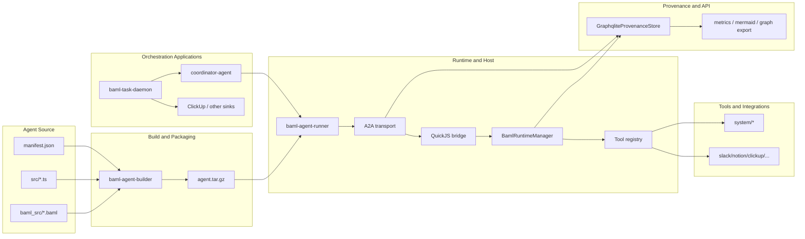

# System Architecture

Agentium OS is a Rust workspace for building, packaging, hosting, and
observing session-based AI agents. The system is designed around a specific
architectural boundary: models may propose actions, but the runtime decides how
those actions are represented, executed, streamed, persisted, and replayed.

Unlike a monolithic chat application, the workspace is split across crates that
separate agent authoring, runtime execution, protocol handling, provenance, and
orchestration. This separation is not cosmetic. It is what allows the platform
to offer typed task lifecycles, Rust-enforced tool session semantics, graph-
backed replay, and multi-agent delegation without relying on prompts alone to
keep the system coherent.

Three design principles shape the architecture.

1. Probabilistic reasoning stops at deterministic boundaries.
   BAML and JavaScript agent code may decide what to do next, but tool session
   execution, task-state transitions, A2A transport behavior, and provenance
   writes are enforced in Rust.

2. Streaming is the primary runtime boundary.
   Agents execute as stream-producing systems first; collection into HTTP JSON,
   stdio responses, or downstream orchestration payloads happens only at the
   outer boundary.

3. Provenance is part of the execution model.
   Context IDs, task IDs, message IDs, tool calls, artifacts, and task updates
   are carried through runtime scope and persisted into a single causality
   graph, making replay and debugging first-class.

Figure 1 sketches the architecture across five layers.

## Overview

The workspace has two entry paths.

The first is the packaged-agent path. An agent is authored as BAML schemas,
TypeScript source, and a manifest, packaged by `baml-agent-builder`, then
loaded by `baml-agent-runner`. Requests arrive over stdio or HTTP A2A, are
executed through the QuickJS and BAML runtime stack, and emit task, message,
artifact, and provenance events as they run.

The second is the orchestration path. Systems such as `baml-task-daemon`
operate outside the runner, ingesting external project context such as Slack
threads, producing typed interpretation events, and optionally delegating to a
hosted coordinator agent over A2A. This path treats the runtime as an execution
substrate rather than as the whole application.

Across both paths, the architectural goal is the same: preserve typed,
inspectable control flow across long-running, multi-turn agent interactions.

## Agent Authoring and Packaging Layer

Agents are authored from three inputs:

- `baml_src/*.baml` for model-facing schemas, prompts, and generated runtime
  types
- `src/*.ts` for agent logic written against the runtime shim and A2A DSL
- `manifest.json` for package identity, tool allowlists, and packaging metadata

`baml-agent-builder` compiles these inputs into a runnable package. The build
pipeline performs four responsibilities:

1. Validate and compile BAML sources into intermediate runtime artifacts.
2. Generate TypeScript runtime types such as `baml-runtime.d.ts`.
3. Lint and compile agent TypeScript with OXC.
4. Package manifest, compiled JavaScript, generated types, and BAML artifacts
   into `agent.tar.gz`.

This layer is the construction phase of the system. It resolves as much
structure as possible before runtime: function signatures, package identity,
tool metadata, and manifest-level capability boundaries. By the time the runner
loads a package, the runtime is not discovering what the agent is from scratch;
it is booting a prepared artifact with an explicit interface.

## Runtime Execution Layer

The execution core lives primarily in `crates/baml-rt-quickjs`, especially
`crates/baml-rt-quickjs/src/baml.rs`. This layer binds together five concerns:

- schema loading and function registration
- QuickJS evaluation
- BAML function invocation
- tool resolution and execution
- runtime scope propagation for tracing and provenance

Execution begins in the QuickJS bridge. When JavaScript invokes a function, the
bridge first checks whether the function exists in the JS runtime. If not, it
falls back to the BAML runtime manager. This produces a unified call surface:
agent authors may write logic in JavaScript while delegating typed reasoning or
planning surfaces to BAML.

The key design choice is that host tool execution does not occur in JavaScript.
BAML may return a declarative `ToolSessionPlan`, but the runtime executes that
plan in Rust. Session semantics such as `Open -> Send -> Next -> Finish/Abort`
are therefore enforced as a finite-state protocol rather than suggested in
prompt text.

This layer also treats execution context as first-class. Runtime scope carries
context IDs, task IDs, message IDs, correlation IDs, and agent identity through
tool execution and effect emission. That is what makes graph-backed context
reconstruction and replay feasible later in the stack.

A subtle but important runtime concern is promise polling. Non-stream JS
promises are polled with effect-gated timeouts so that the runtime can
distinguish "no progress is happening" from "LLM or tool work is in flight but
not yet resolved." This prevents false idle timeouts from masquerading as agent
failure, especially under slow CI or busy runtimes.

## Tool and Integration Layer

The tool layer is built on `baml-rt-tools`. It provides the metadata contracts,
registry, executor abstraction, and session FSM primitives used by the runtime.
Concrete tools then live in workspace crates such as:

- `crates/tools/system`
- `crates/tools/notion`
- `crates/tools/clickup`
- `crates/tools/slack`
- `crates/tools/memory`

This layer distinguishes between two execution models.

First, host tools execute in Rust and can be one-shot or session-based. Session-
based tools are the normal path for external systems that require multiple
turns, intermediate state, or resumable workflows. The runtime owns these
sessions explicitly.

Second, JavaScript tools remain available through JS-side invocation, but they
do not mediate host sessions. This preserves a clear boundary: host-side
capabilities with persistence, provenance, or protocol implications stay under
runtime control.

Tool access is intentionally explicit. Agents and packages are expected to use
manifest allowlists, typed tool inputs, and narrow surfaces rather than broad,
stringly-typed capability exposure. Read-only tools provide auditable data access,
while write-capable tools are expected to sit behind tighter validation and
host-level control.

The coordinator path extends this layer with discovery-oriented system tools.
The coordinator agent can discover available agents and tools, route to a
specialist, delegate through `system/internal_a2a`, and synthesize a typed
response with explicit gaps and confidence markers.

## A2A Transport and Runner Layer

The host surface is built from `baml-rt-a2a` and `baml-agent-runner`.

`baml-rt-a2a` provides:

- JSON-RPC request and response types
- task lifecycle semantics
- stream chunk types for status, message, and artifact updates
- request handling for multi-turn A2A conversations
- resume routing for pending `awaitInput` turns by task/context key

`baml-agent-runner` sits above that transport and loads packaged agents into a
single host process. It validates archives, boots QuickJS runtimes, injects the
A2A DSL shim, and exposes execution over stdio or HTTP.

The transport is stream-first by design. Handlers expose `handle_a2a_stream`,
and callers decide whether to forward chunks live or collect them into a final
response. This is what allows the same execution core to serve:

- stdio agents
- HTTP JSON-RPC collection endpoints
- HTTP SSE streaming endpoints
- internal agent-to-agent delegation

Task lifecycle semantics are also owned here. States such as `SUBMITTED`,
`WORKING`, `INPUT_REQUIRED`, `COMPLETED`, and `FAILED` are not just UI labels;
they define the resumable control flow for multi-turn agents. `INPUT_REQUIRED`
is especially important because it marks a non-final turn boundary: the current
stream can end while the task remains live and resumable.

Operationally, the runner has one critical invariant: stream tasks must live on
the same long-lived Tokio runtime that owns the HTTP server. Short-lived nested
runtimes break SSE behavior by dropping spawned tasks after the handler returns.

## Provenance and Persistence Layer

The persistence model is graph-native. `baml-rt-provenance` records runtime
events, normalizes them into a PROV/A2A graph model, persists them in
GraphQLite, and serves graph-backed reads for both runtime context and API
surfaces.

The central architectural correction in this repo is the single-store design.
In persistent mode, the runtime does not keep one concrete store for task state
and another for provenance. Instead, a single `GraphqliteProvenanceStore` is
projected into narrow traits used by runtime, A2A, and API code. Task writes,
status updates, message persistence, artifacts, and provenance events therefore
share one causality graph.

This layer has three responsibilities.

1. Write path.
   Runtime and transport components emit typed provenance events around LLM
   calls, tool calls, task lifecycle updates, messages, and artifacts.

2. Read path.
   Runtime code reconstructs conversation context from persisted provenance
   rather than from an unrelated side channel.

3. Export path.
   API and CLI consumers query the graph for Mermaid sequences, DOT graphs,
   context metrics, and provenance operations views.

The result is that "what happened?" and "what context should the agent see now?"
are answered from the same system of record.

## Orchestration and Application Layer

Above the runtime sit application-level systems that use the host in different
ways.

Specialist agents such as Notion, Slack, and other tools show how packaged
agents can execute against typed tool surfaces with provenance capture. The
coordinator agent demonstrates dynamic delegation: discover capabilities, choose
the appropriate specialist, call it through internal A2A, and synthesize an
auditable final answer.

`baml-task-daemon` demonstrates a different pattern. It is not itself the
runtime host. Instead, it reads various sources (Slack, ClickUp, etc.) and
interprets them into a typed event contract, and optionally hands that typed
workflow seed to a coordinator agent over A2A. This creates a higher-level
architecture:

- external input as source data
- typed interpretation as orchestration boundary
- hosted agent runtime as execution substrate
- provenance as replay and accountability surface

The event contract is important here. `InterpretationRequestEvent` and
`InterpretationResultEvent` define a stable handoff between polling,
interpretation, orchestration, and sink delivery. In practice, they serve the
same role for external input that the A2A task contract serves for
conversation turns: they turn open-ended text into typed execution input.

## Verification as Architectural Enforcement

Although tests are not a runtime layer, they function as an architectural
enforcement mechanism in this workspace. `docs/testing-handbook.md` makes the
intended strategy explicit:

- prefer vertical slices over isolated unit shards
- define one authoritative E2E per behavior
- encode invariants directly, including concurrency and provenance isolation
- treat malformed inputs and error paths as first-class

This matters because many of the platform's most important guarantees are not
visible in type signatures alone: stream chunk order, task finality, scope
attribution, tool session lifecycle, and provenance non-contamination under
concurrency. The test suite therefore acts as a second harness around the
runtime, preventing architectural drift.

## Architectural Summary

The architecture of Agentium OS is best understood as a chain of typed
boundaries:

1. agent source becomes a packaged artifact
2. the package is loaded into a runtime host
3. the runtime executes BAML and JS logic under Rust-controlled tool semantics
4. A2A transport turns execution into resumable task streams
5. provenance persistence turns runtime behavior into a replayable graph
6. orchestration systems such as the coordinator and task-daemon build higher-
   level workflows on top of those guarantees

The central insight is that the workspace is not trying to make models
trustworthy by prompt instruction alone. It is trying to surround model output
with deterministic packaging, execution, protocol, and persistence machinery so
that agent behavior remains bounded, inspectable, and composable as the system
scales from single-agent demos to multi-agent project orchestration.
