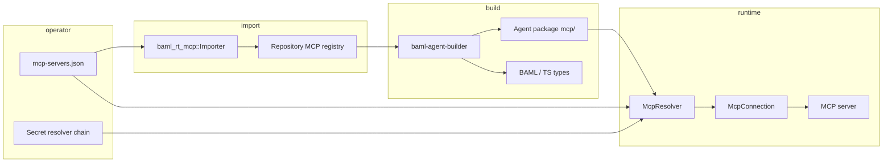

# Agentium MCP Support

This document describes how Agentium integrates the [Model Context Protocol (MCP)](https://spec.modelcontextprotocol.io/) across **configuration**, **registry import**, **agent build/type generation**, and **runtime execution**.

For a focused walk-through of pooled connections and drift handling, see [MCP Runtime Lifecycle and Pooling](mcp-runtime-lifecycle.md). For host-tool ergonomics including CLI examples, see [Host tool guide §11 — MCP tools](host-tool-guide.md#11-mcp-tools-approved-server-snapshots).

## 1. Crate layout and responsibilities

| Area | Crate / module | Role |
|------|----------------|------|
| MCP wire client for import discovery | `crates/baml-rt-mcp` (`client`, `sandbox`, `importer`) | Spawn a stdio MCP server in a sandbox, run `initialize` + `tools/list`, produce a **pending** `McpServerSnapshot`. |
| Runtime transport + verification | `crates/baml-rt-mcp` (`runtime`, `handler`, `http`) | Lazily connect (stdio **or** Streamable HTTP via `rmcp`), verify identity/tools digests, execute `tools/call`, map results to the platform envelope. |
| Resolver binding snapshots to handlers | `crates/baml-rt-mcp` (`resolver`) | Loads approved cache entries, checks approvals, verifies **live operator config matches** sealed `server_config_digest`, resolves secrets, pools `McpConnection`. |
| Operator config schema | `crates/baml-rt-tools` (`mcp_config`) | Parses and validates `mcp-servers.json` (stdio + `streamable_http`). |
| Snapshots & digests | `crates/baml-rt-tools` (`mcp_snapshot`) | Immutable server/tool records, approval states, digest types. |
| On-disk cache layout | `crates/baml-rt-tools` (`mcp_cache`) | `servers/<id>/`, `tools/<slug>/` under the MCP cache root used by runner and builder. |
| Builder projection | `crates/baml-rt-tools` (`mcp_builder_catalog`) | Maps approved MCP tools to `ToolFunctionMetadata` (**same projection** the resolver uses via `project_tool`). |
| Type generation orchestration | `crates/baml-rt-builder` (`runtime_type_gen`) | Fetches snapshots from registry, writes `<build>/mcp/`, merges MCP tools into the external-tool catalog for BAML/TS generation. |

`baml-rt-mcp` intentionally keeps thin boundaries: protocol/session logic lives next to `rmcp`, while durable contracts and codegen share `baml-rt-tools` types.

## 2. Mental model: registry-first, snapshot-sealed runtime

Operator workflow:

1. Declare how to reach each MCP server in **`mcp-servers.json`** (local stdio binary **or** remote Streamable HTTP URL).
2. **Import** by connecting to that server (today: **stdio only** for import — see §5), capturing normalized tool schemas and digests into the **repository registry**.
3. **Approve** snapshots in the registry (via `mcp enable` / builder path); only **approved** server + tool entries participate in codegen and runtime binding.
4. **Allowlist** concrete platform tools in the agent **`manifest.json`**, for example `"mcp/meteo/get_meteo"`.
5. **Build** with registry access (`BAML_MCP_REGISTRY_URL` or embedded registry service) so the builder materializes snapshots under **`mcp/`** in the artifact and generates BAML/TypeScript surfaces.
6. **Run** with the **same shape** of `mcp-servers.json` (and resolved secrets): the resolver recomputes `server_config_digest` and **refuses** to bind if operator config drifted away from what was sealed at approval time.

Agents should list **individual** `mcp/<server>/<tool>` names, not a generic dynamic gateway tool.

### 2.1 End-to-end data flow



## 3. `mcp-servers.json` location

- **Default:** `$HOME/.agentium-os/mcp-servers.json`
- **Override:** set `BAML_MCP_SERVERS_CONFIG` to an absolute path (see `baml_rt_mcp::resolver::MCP_SERVERS_CONFIG_ENV`).

The file uses the conventional top-level key **`mcpServers`** (Claude Desktop–compatible shape), extended with **`secrets`** and **`sandbox`** for Agentium.

## 4. `mcpServers` schema reference

Rust source of truth: `crates/baml-rt-tools/src/mcp_config.rs` (`McpServersFile`, `McpServerConfig`, validation in `validate()`).

### 4.1 Common fields (all transports)

Each server entry is keyed by a **server id** (ASCII letters, digits, `_`, `-` only).

| Field | Stdio required? | Notes |
|-------|-----------------|-------|
| `command` | Yes when `transport` is omitted | Executable for stdio transport. Ignored when `transport.kind` is `streamable_http` (leave empty JSON). |
| `args` | No | Passed to stdio subprocess. |
| `env` | No | Plain, non-secret environment variables for stdio children. Values that look like secrets in the **key name** are rejected (e.g. `TOKEN`, `API_KEY`). |
| `secrets` | No | Declarations `{ "name": "ENV_VAR", ... }`. Resolved through the runner’s secret resolver and injected according to transport (stdio: child env). |
| `sandbox` | No | `profile`, `import_timeout_secs`, `runtime_call_timeout_secs` (defaults **30s** startup / discovery, **120s** per-call if omitted). |
| `description` | No | Shown by operator tooling; not load-bearing for digests. |
| `transport` | No | Omit for legacy stdio. Set to Streamable HTTP object for remote MCP. |

### 4.2 Stdio example

```json
{
  "mcpServers": {
    "meteo": {
      "command": "/abs/path/to/meteo-mcp",
      "args": [],
      "env": {
        "METEO_MODE": "demo"
      },
      "secrets": [],
      "sandbox": {
        "profile": "mcp-import-restricted",
        "import_timeout_secs": 30,
        "runtime_call_timeout_secs": 120
      },
      "description": "Open-Meteo demo MCP server (stdio)"
    }
  }
}
```

Runtime behaviour (summary):

- Child is spawned with **`env_clear()`**, then **`PATH`** from the runner is restored unless overridden in `env`, then plain `env` entries, then secret injections as env vars (`baml_rt_mcp::runtime`).

### 4.3 Streamable HTTP (`transport.kind`: `"streamable_http"`)

```json
{
  "mcpServers": {
    "grafana": {
      "transport": {
        "kind": "streamable_http",
        "url": "https://mcp.example.com/mcp",
        "headers": [
          { "name": "X-Client-Name", "value": "agent-platform" }
        ],
        "auth": {
          "kind": "bearer",
          "token_ref": { "source": { "kind": "env", "name": "GRAFANA_MCP_TOKEN" } }
        },
        "timeouts": {
          "connect_ms": 5000,
          "request_ms": 60000,
          "idle_stream_ms": 30000
        },
        "pooling": {
          "share_safe": false,
          "max_idle_per_host": 8,
          "idle_ttl_ms": 300000
        },
        "network_policy": {
          "allow_hosts": [],
          "allow_private_ips": false,
          "follow_redirects": false
        }
      },
      "command": "",
      "args": [],
      "env": {},
      "secrets": [],
      "sandbox": {
        "import_timeout_secs": 30,
        "runtime_call_timeout_secs": 120
      }
    }
  }
}
```

**Shapes:**

- **`auth`** (optional): tagged union
  - `{ "kind": "bearer", "token_ref": { "source": { "kind": "env", "name": "..." } } }`
  - `{ "kind": "header", "header": "X-API-Key", "value_ref": { ... } }`
  - `{ "kind": "basic", "username": "u", "password_ref": { ... } }`
- **`timeouts`:** `connect_ms`, `request_ms`, `idle_stream_ms` — defaults documented in `mcp_config.rs`. Note: despite the name, `idle_stream_ms` is wired to the HTTP client idle pool TTL, not an MCP SSE deadline (see runtime comments).
- **`network_policy`:** `allow_hosts` (empty means derive allowlist from URL host); `allow_private_ips`; `follow_redirects` (defaults **false**).

**Validation at parse time (config layer):**

- URL must be absolute `http` or `https` with host, **no userinfo**, **no query string**.
- Header names non-empty when using custom auth/header entries.

**Validation at transport build (runtime):** `baml_rt_mcp::http::policy`

- Rejects plaintext `http://` when auth secrets exist.
- Blocks URL userinfo and secret-shaped query keys (defense in depth).
- Enforces host allowlist and literal private/loopback IP rules (`allow_private_ips`).

Secrets for HTTP auth are **`SecretSpec`** projections: source is **`env:name`** today; injection can be Bearer, arbitrary header, or Basic password contribution (`mcp_config::secret_specs()`).

### 4.4 Import vs runtime transport support

| Capability | Stdio | Streamable HTTP |
|------------|:-----:|:-----------------:|
| **Registry import / `mcp enable` discovery** | Yes | **Not implemented** — importer returns `UnsupportedTransport` for HTTP. |
| **Runtime `tools/call`** | Yes | Yes (via `rmcp` + reqwest **0.13** in `baml-rt-mcp`) |

Production-style **approval** for remote servers still assumes you captured schemas through a trusted import path — today that means **stdio import** against a connector you control, not “point import at arbitrary HTTPS MCP.” Until HTTP import exists, operators typically import via a known local stdio bridge or similar.

## 5. Digests, identity, and “approval” semantics

Snapshots (`mcp_snapshot::McpServerSnapshot`) seal several digests:

- **`server_config_digest`**: Hash over server id, **pinned protocol version**, normalized operator-facing launch config (**including non-secret env** values for stdio, transport URL/policy for HTTP), and the **approved tools digest**. Changing `METEO_MODE` or HTTP URL/policy shifts this digest ⇒ operator must re-import/approve **and** align `mcp-servers.json`.
- **`server_identity_digest`**: From MCP `capabilities` + `serverInfo.name` at import (`compute_server_identity_digest`). Runtime recomputes from live `initialize` and fails closed on mismatch.
- **`tools_digest`**: Canonical digest over sorted `(mcp_tool_name, normalized input_schema_digest)` entries. Checked at lazy connection startup (`tools/list`) and after **`notifications/tools/list_changed`** (`baml_rt_mcp::runtime`).

**Approval state** (`McpApprovalState`): `pending`, `approved`, `rejected`, `stale`. Runtime and builder only bind **approved** tools whose parent server is also **approved** (`resolver.rs`, `mcp_builder_catalog.rs`).

**Stale:** When drift is detected at runtime (startup mismatch or tool list notifications), the server record can be marked **stale** on disk (`mcp_cache::mark_server_stale`) so the next runner startup refuses that snapshot until re-import.

## 6. Repository registry and CLI

Snapshots are stored in the **embedded repository service** backing the runner. REST surface used by tooling (append to your `--repository-url` base):

| Method | Path | Purpose |
|--------|------|---------|
| GET | `/mcp/servers` | List servers |
| GET | `/mcp/servers/{id}` | Latest snapshot metadata |
| GET | `/mcp/servers/{id}/versions` | Version listing |
| GET | `/mcp/servers/{id}/versions/{v}` | Specific version |
| GET | `/mcp/tools?platform_tool_name=...` | Tool rows |

Operator CLI (uses shared builder library; no `baml-agent-builder` subprocess):

```bash
cargo agent-platform mcp enable <server-id> \
  --config ~/.agentium-os/mcp-servers.json \
  --repository-url http://127.0.0.1:18080/repository \
  [--yes] [--runner-token ...]
cargo agent-platform mcp list --repository-url http://127.0.0.1:18080/repository
cargo agent-platform mcp server meteo --repository-url ...
cargo agent-platform mcp tool mcp/meteo/get_meteo --repository-url ...
```

- **Mutating** registry enablement may require **`RUNNER_TOKEN` / `--runner-token`** when the runner enforces operator auth.
- Read-only **`mcp list` / `server` / `tool`** calls use anonymous GET against the repository URL (`crates/cargo-agent-platform/src/commands/mcp.rs`).

## 7. Agent integration: manifest and naming

Manifest allowlists **platform tool names**:

```json
{
  "version": "1.0.0",
  "name": "meteo-mcp-agent",
  "entry_point": "src/index.ts",
  "tools": ["mcp/meteo/get_meteo"]
}
```

Pattern: **`mcp/<server_id>/<mcp_tool_name>`** where `server_id` matches the key under `mcpServers` used at import/runtime, and `mcp_tool_name` is the MCP `tools/list` entry name before normalization.

Discovery metadata (`discovery.description`, tags) is product-facing only; toolchain enforcement is **`tools`**.

Reference example: `examples/agents/meteo-mcp-agent/manifest.json`.

## 8. Build process: snapshots → cache → `ToolFunctionMetadata` → BAML/TS

1. **`prepare_mcp_registry_cache`** (`runtime_type_gen.rs`): From manifest `"tools"` it collects **`mcp/` server ids**, then:
   - **Embedded path:** pulls latest approved snapshot via `RepositoryService::get_latest_mcp_snapshot(server_id)` (publisher/builder with in-process registry).
   - **Remote path:** **`BAML_MCP_REGISTRY_URL`** set → GET `{url}/mcp/servers/{server_id}` JSON into `build_dir/mcp/` via `mcp_cache::write_snapshot`.

2. **Catalog merge:** `build_builder_catalog_with_mcp_root(Some(build_dir.join("mcp")))` merges MCP-derived tools into the same catalog used for ordinary external/host tools (`mcp_builder_catalog::project_tool`).

3. **Rendering:** MCP tools compile into normal BAML function/class shapes with `ToolBackend::Mcp`; input schemas come from normalized JSON Schema (or **`OpaqueJson`** when the normalizer cannot represent the schema — flagged with `opaque_fallback_reason`).

4. **Packaging:** `packager.rs` adds the `mcp/` tree into the agent tarball so runners without separate registry egress still carry the pinned snapshot files.

Developer commands (when using HTTP repository):

```bash
BAML_MCP_REGISTRY_URL=http://127.0.0.1:18080/repository \
  cargo agent-platform build --path examples/agents/meteo-mcp-agent

BAML_MCP_REGISTRY_URL=http://127.0.0.1:18080/repository \
  cargo agent-platform regen --path examples/agents/meteo-mcp-agent
```

Advanced: **`BAML_MCP_CACHE_DIR`** points the builder/tests at an explicit MCP cache root (`mcp_builder_catalog::BUILDER_MCP_CACHE_ENV`).

Demo script: **`scripts/meteo_mcp.sh`** (`runner` / `chat` / `review`).

## 9. Runtime tool session behaviour

Each approved MCP platform tool becomes an **`McpToolHandler`** (`handler.rs`), sharing one **`McpConnection`** per pool key:

- Resolver pool key facets: **`agent_scope`**, **`server_id`**, **`server_config_digest`**, **`secret_fingerprint`**, **`transport` discriminant**, **`protocol_version`** (`resolver.rs`).
- Connections are reused across chats/contexts inside one runner unless config, secrets, transport, digest, or server death/expiry forces a rebuild.

**Tool session semantics:**

- **`open`** → allocates `McpToolSession`.
- **`send`** → asserts single-flight (`InFlight`), calls `tools/call`, converts `CallToolResult` to `{ content, structured, is_error, metadata }` envelope (`result_to_envelope`).
- **`read`** → returns `Done` with that envelope.
- **`abort`** → local cancellation + best-effort `notifications/cancelled` (bounded; HTTP transports may defer delivery behind in-flight POSTs).

**Errors:** Mapped to **`ClassifiedToolError`** with disposition (e.g. digest mismatch ⇒ fatal **contract violation**; transient network ⇒ host-retriable). JSON-RPC **`INVALID_PARAMS` / `METHOD_NOT_FOUND`** map to **`invalid_input`** for LLM-visible correction loops.

### 9.1 Denied MCP client features

Runtime client handler denies server→client calls that Agentium does not support as a MCP **client**:

- Roots listing, sampling / `createMessage`, structured elicitation — **hard `METHOD_NOT_FOUND`**.

Progress notifications are logged at **info**.

## 10. Sandbox and import hygiene

Importer (`importer.rs`):

- Spawns stdio MCP in **Tier‑1 sandbox** (`sandbox.rs`, profile from config or **`mcp-import-restricted-tier1`** default).
- Enforces MCP **protocol version** matches the pinned client (`CLIENT_PROTOCOL_VERSION`); mismatches fail closed at import to protect digest stability.
- Resolves **`secrets`** for the import child strictly (missing ⇒ `MissingSecret`).
- Normalizes schemas (`mcp_schema_normalize`); unsupported constructs become **opaque fallback** tooling with reasons recorded in the snapshot.

## 11. Operational checklist

**Before trusting an MCP tool in prod**

- [ ] `mcp enable` succeeded; `mcp server <id>` shows **`approval_state`** as approved on both server and desired tools.
- [ ] **`mcp-servers.json`** on runners matches sealed digest semantics (changing env/URL/commands ⇒ re-enable + redeploy).
- [ ] Required secret env vars exist in fnox/OS env for **every** `secrets`/`token_ref.password_ref`/`value_ref.source`.
- [ ] Manifest lists only enumerated **`mcp/...`** tools you reviewed.
- [ ] Understand **HTTP** cannot be imported today — only operated at runtime with pre-approved snapshots (usually from earlier stdio import).

**Failure patterns**

| Symptom | Likely cause |
|---------|----------------|
| Launch config digest mismatch | Operator changed `mcp-servers.json` without re-import (`resolver::connection_for` error log `mcp.launch_config_digest_mismatch`). |
| Tool/identity digest mismatch / stale file | MCP server upgraded or tools changed; rerun `agent-platform mcp enable` and redeploy. |
| “not declared in mcp-servers.json” | Cache has approved server snapshot but runner config missing that **`mcpServers` key**. |

## 12. Metrics and telemetry

Exported counters/digests hooks include MCP session/registry recreation and digest mismatches (see **`docs/metrics-inventory.md`**, entries prefixed with `mcp.`).

Spans: tool calls annotate server id, tool name, **`mcp_schema_digest`**, **`mcp_server_config_digest`**, protocol version (`handler.rs`).

---

*This guide reflects the **`baml-rt-mcp`** + **`baml-rt-tools`** integration as implemented in-tree. Behavioural regressions belong in CI tests under `crates/baml-rt-mcp/tests/` and builder tests such as **`crates/baml-rt-builder/tests/mcp_codegen_test.rs`.*
