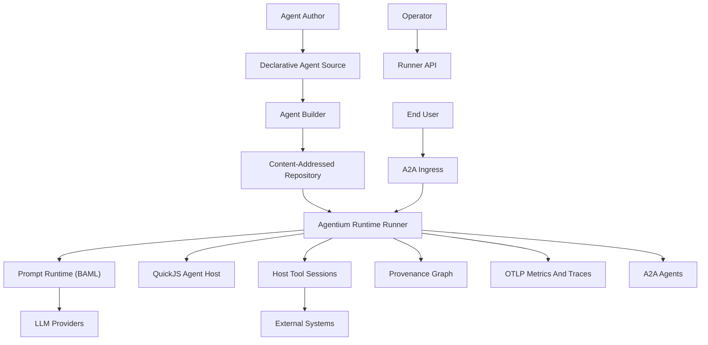
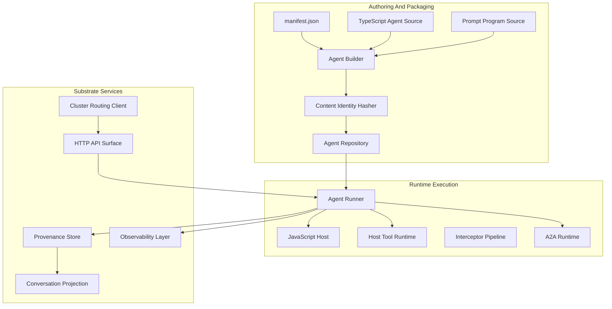
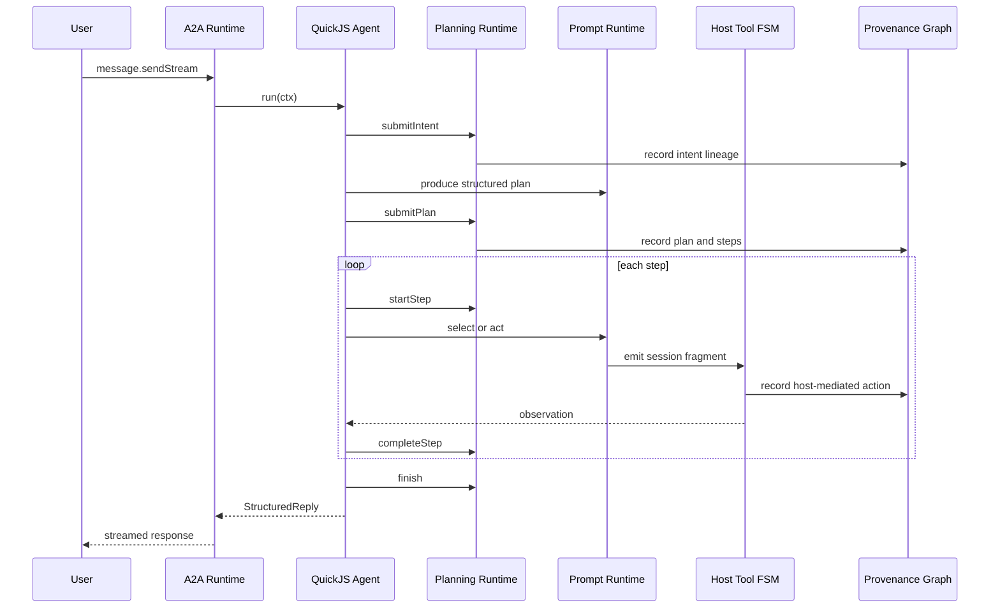
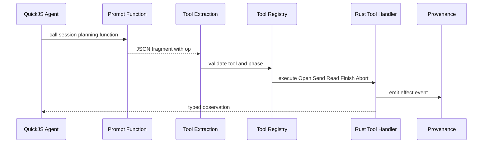
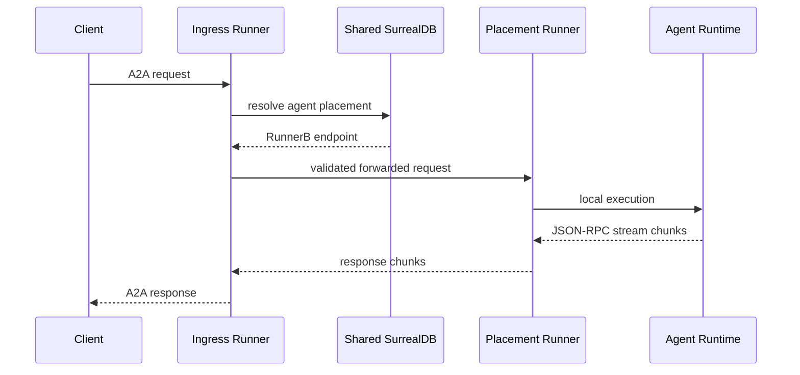
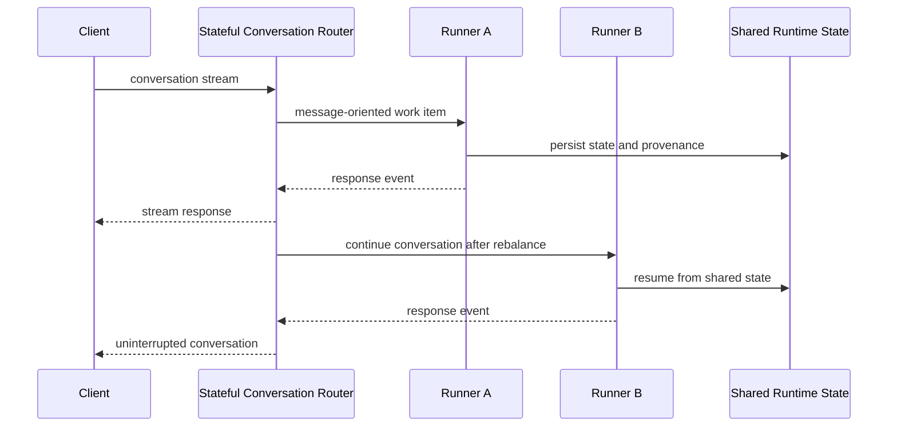

# Agentium OS Architectural White Paper

Agentium OS is presented here as an architectural thesis for design partners and early
adopters. Agentium OS is a unified runtime and provenance substrate for declarative agents,
distinct from application-framework-style agent stacks.

## Executive Thesis

Agentium OS executes agents as declarative software artefacts on a shared runtime substrate. The
runtime owns execution, planning, tool sessions, protocol boundaries, package identity, routing,
and provenance capture. Because every agent action is mediated by the host, the runtime has perfect
observability of agent behavior inside the runtime boundary.

External systems remain outside the runtime boundary. Agentium OS observes agent-mediated
interactions as they cross host-visible surfaces: every agent-mediated LLM call, tool action,
A2A interaction, task transition, message, artifact, and provenance event is mediated by the
substrate and recorded at that boundary.

Agentium agents are ReAct-capable task actors with enforced planning and execution
semantics: behavior is organized around tasks, plans, steps, and structured outcomes rather
than open-ended chat transcripts with ad hoc tool calls. Plans, citations, lineage, step
execution, tool-session phases, and structured replies are runtime concepts rather than
informal prompt conventions.

Agentium uses **BAML**, a **prompt runtime language**
that combines typed prompt programs with a runtime that executes them against models.
In plain language, it is the language and runtime used to define structured prompting,
schemas, and typed outputs so LLM calls are expressed as explicit programs rather than
unstructured strings.

The agent artefact is also materially different from a conventional software package.
The canonical shareable unit is a hashed, content-addressable source bundle: manifest,
TypeScript agent source, and prompt-program definitions. It is declarative content executed by
the trusted runtime as an immutable shareable unit without an external dependency graph of its
own. Runtime components, external tools, container images, and operator environments still carry
their own supply-chain inventories, but the agent itself is a higher-confidence artefact for
sharing within and between organisations.

For clustered deployments, Agentium OS has a core architectural commitment: router-held
stateful conversations. The router holds client conversation continuity at the edge and
translates it into message-oriented runtime communication for agent LLM, tool, and A2A
calls. The result is runtime rebalancing and rolling agent updates without dropping
conversations. Cluster placement, shared state, cross-pod A2A forwarding, deployment
lifecycle APIs, and channel-oriented runtime design are the substrate mechanics that make
this continuity model coherent.

## Design Goals And Architectural Drivers

### 1. Declarative Agents As Runtime-Bound Artefacts

Agentium agents should be authorable as compact, inspectable artefacts bound to the runtime
through declared surfaces and packaging contracts. Agent source is built from a manifest, TypeScript
entrypoints, prompt-program schemas and functions (BAML), generated runtime types, and
session-plan metadata.
The runtime interprets and executes this artefact through known boundaries.

This goal is the root of the architecture. The runtime can reason about an agent because
behavior is expressed through declared surfaces with explicit contracts. The agent declares
capabilities, plans work, asks the host to execute tool sessions, and emits operator-visible
structured replies.

The authoring surface is intentionally small and composable: manifest, TypeScript
orchestration, prompt-program definitions, generated typing for prompts and tools, and
packaged deployment artefacts. The build pipeline compiles TypeScript, generates
prompt-runtime types from compiled prompt-program definitions, emits runtime typings, and
packages the agent for operator deployment. The runner loads packaged agents, executes them
on the substrate, and exposes operator and conversational surfaces through declared orchestration
and prompt-program entry surfaces.

### 2. Perfect Observability Of Agent Behavior

Within the Agentium runtime boundary, every agent action is mediated by the host. That
is the basis for perfect observability of agent behavior. The runtime sees the agent's
planning lifecycle, LLM calls, tool-session transitions, A2A interactions, messages,
artifacts, task lifecycle, and provenance emissions because those actions are mediated
by the host.

Agent-mediated contact with external systems is recorded where it crosses host-visible surfaces:
when the agent requests an LLM completion, calls a host tool, delegates through A2A, emits an
artifact, or advances a task, that action passes through runtime machinery and becomes part of
the substrate transcript.

Provenance records typed runtime events into a graph-normalized model persisted in SurrealDB.
Conversation projection reconstructs agent-visible history from that graph and keeps
canonical history separate from phase overlays used for prompting. OpenTelemetry spans and
metrics provide operational visibility; provenance remains the semantic transcript of agent
behavior inside the runtime boundary.

### 3. Enforced Planning And ReAct-Capable Task Execution

Agentium agents should reason, plan, act, observe, and revise under runtime supervision.
Planning is expressed through explicit runtime primitives such as intent submission, plan
submission, step start, step completion, finish, supersession, and citation-bound lineage.

This lets Agentium agents operate as task actors. The agent can classify a turn, derive
intent, produce a structured plan, execute steps through host-mediated actions, revise
when observations invalidate the plan, and produce a structured final reply. The runtime
can observe and validate this flow because plan and step mutations are explicit.

Planning primitives are explicit runtime operations with protocol semantics. Intent submission,
plan submission, step lifecycle, supersession, and citation-bound lineage are host-visible
protocol surfaces. Session prompt construction treats plan anchoring and iterative solving as
first-class engineering concerns rather than ad hoc context stuffing. Citations and lineage are
host-bound and validated against stable runtime-derived references. Generated step execution
is authoritative in the Rust runtime loop, keeping transitions enforceable even when JavaScript
orchestrates the outer task flow.

### 4. Host-Owned Tool Sessions And External Effects

External effects are mediated by the host through declared tool sessions. Prompt programs emit
tool-session fragments, and Rust executes the finite-state machine. The legal lifecycle is
Open, Send or Read, then Finish or Abort, with phase-specific generated types preventing
invalid transitions from becoming normal runtime behavior.

This design gives the runtime a durable boundary around tool use. Tool access can be
allowlisted in the manifest, represented in generated prompt-runtime types, executed by Rust,
and
captured in provenance.

Tool implementations are defined by contracts, metadata, schemas, and session-plan bindings.
JavaScript orchestration never executes effects directly; the host interprets each hop.

Partners can author **standalone external tools** outside the Agentium OS tree: a tool directory
carries metadata and an implementation that satisfies the host tool protocol. Operators register
those packages with the runner at deploy time. The host still owns the session finite-state
machine, phase validation, allowlists, and provenance regardless of where the implementation was
built.

Selectable **tool backends** keep that boundary stable while widening how implementations ship:

- **Static tools** are compiled into the platform binary and invoked in-process for tightly
coupled integrations.
- **External process tools** run as host subprocesses using the same framed protocol over
standard I/O.
- **Sandbox tools** run inside a **microVM-isolated guest** (microsandbox-backed): the host
launches a guest **adapter** that speaks the protocol from inside the sandbox while the runner
applies network posture, secrets binding, and lifecycle limits at the isolation boundary.

All paths converge on one substrate rule: the agent receives typed observations only after host
mediation. Coordinator-level planning artifacts use distinct shapes from executable tool-session
fragments so strategic orchestration stays explicitly layered above tactical tool execution.

### 5. Source-Bundle Identity And No External SBOM For Agents

Agentium agents should be shareable as content-addressed declarative source bundles with
inspectable structure and lineage. Canonical identity is a validated SHA-256 content hash over the
declarative source bundle (manifest, TypeScript source, and prompt-program source) after
repository-assigned version stamping in the manifest. Publish flows compute identity from
authoritative source inputs, build deployable archives server-side, enforce hash integrity at
publish time, and store lineage as immutable entries. Deploy-by-hash ties runtime activation to
that identity so operators promote agents as immutable artefacts rather than floating package
versions. The
deployable archive contains generated and runtime support artefacts, but the shareable agent
identity remains the declarative source bundle.

This is the basis for the no-external-SBOM claim. The agent itself has no external software
dependency tree of its own. It is executed by the trusted runtime and may use runtime-provided
tools while remaining a declarative package rather than a general-purpose installable dependency
graph.

### 6. Cluster-Aware Conversation Continuity

Agentium OS should preserve conversations while allowing clustered runtimes to rebalance
work and roll agent versions. The router holds client conversation continuity at the edge
and turns conversational connectivity into message-oriented runtime work.
That enables a runner or agent instance to change without forcing the client conversation
to drop.

Cluster deployments use multiple runners backed by shared SurrealDB state, cluster runner
registration, agent placement, heartbeat-based liveness, cross-pod A2A forwarding driven by
placement resolution, validated forwarding paths, migration controls, and channel-oriented
runtime design. Together these substrate mechanics realize clustered continuity without tying
client conversations to a single execution pod. Kubernetes installs ship as a Helm chart as
the supported operator surface. Forwarding, migration controls, heartbeat-driven runner
liveness, and multi-agent routing are first-class cluster behaviors. Continuity is layered: the
router preserves client-attached streams at the edge, while shared stores, placement, migration
controls, and provenance-backed task state provide durable coordination behind that edge.

## System Context

Agentium OS is easiest to understand from the outside in: first the actors and external
dependencies, then the runtime boundary, then the deployable services inside that boundary.

Boundary definition: external systems sit outside Agentium OS; agent-mediated interactions pass
through host-visible runtime interfaces.

## Solution Strategy

Agentium OS uses a typed Rust host to turn declarative agent artefacts into observable
ReAct executions. The host coordinates the prompt runtime (BAML), QuickJS entrypoints,
generated runtime types,
tool-session FSMs, A2A transport, repository deployment, provenance graph writes, and
operator APIs.

The solution strategy has seven pillars:

- **Unified runtime substrate:** agent behavior executes through explicit host surfaces with
protocol-visible transitions.
- **Planning as protocol:** intent, plan, step, finish, citation, and supersession are
runtime concepts.
- **Host-owned external effects:** LLM, tool, A2A, task, message, and artifact actions
cross host-visible boundaries.
- **Graph-first provenance:** conversation history and citations reconstruct from recorded graph
edges anchored to runtime-derived identities.
- **Content-addressed distribution:** agent source bundles are hashed and deployed by
identity.
- **Cluster as substrate:** placement, forwarding, shared state, and router-held
conversations together define uninterrupted clustered operation.
- **Operator separation:** public A2A routes and token-authenticated operator routes have
different trust boundaries.

## Static Architecture

Static architecture groups collaborating services by responsibility. The decomposition below names
the major services that recur throughout runtime, deployment, and operations narratives.

Authoring and packaging services establish the agent as a content-addressed source bundle.
Runtime execution services host JavaScript orchestration, prompt-runtime execution, A2A, and
tools. Substrate services provide provenance, conversation projection, observability, HTTP API
boundaries, and cluster routing helpers.

## Runtime Flows

### Enforced Planning And ReAct Execution

### Tool Session Execution

Tool effects are owned by the host runtime. The prompt runtime returns a declarative fragment;
Rust extracts it, the tool registry validates phase and policy, the host executes the session hop
(in-process, via an external tool process, or by driving a sandbox guest adapter), and provenance
records the mediated action.

### Cluster Forwarding

### Router-Held Stateful Conversations

## Deployment And Operations Model

Kubernetes installs ship through a published Helm chart for Agentium OS. A representative
cluster topology runs multiple runner replicas backed by shared SurrealDB. Runner identity and
deployment environment are exported through OpenTelemetry resource attributes. Operator routes
are token-authenticated in cluster mode while conversational endpoints remain part of the public
surface behind network isolation policies. Repository storage and runner-local deployment state
are intentionally separated so artefacts remain immutable while runtime activation evolves.
Deployments are hash-centric with restore semantics tied to recorded deployment state.

The router is the durable conversation edge. Runtime work behind that edge is message-oriented.
Rebalancing and rolling agent updates preserve client-attached conversations. Operational practice
pairs edge continuity with cluster placement, shared persistence, and controlled migration so
work relocates cleanly while clients keep a single conversational attachment point.

## Cross-Cutting Concepts

### Security

Security is expressed as enforceable runtime boundaries. Effects require host mediation: tools are
host-orchestrated and manifest-allowlisted, and privileged operator APIs are token-authenticated in
cluster mode. Sandbox-mode tools add microVM isolation and host-defined network posture around the
guest adapter. Cross-runner communication is designed for validated forwarding within isolated
cluster networks, with SSRF protections on control-plane targets.

### Provenance

Provenance is the semantic transcript of record for agent behavior inside the runtime boundary.
Runtime events are normalized into graph form, conversation history is projected from that graph,
and citations refer back to stable runtime-derived references.

### Observability

OpenTelemetry spans and metrics provide operational visibility into ingress, routing,
effects, tools, LLM calls, provenance I/O, and runner identity. Provenance carries the semantic
history of agent behavior; OpenTelemetry carries the operational measurement surface for running
production clusters.

### Extensibility

Extensibility comes through declarative agent packages, prompt-program schemas and
functions (BAML), generated
runtime types, platform-built tools, independently packaged external tools (subprocess or
microVM sandbox adapters), event dispatch, A2A, and repository
lineage. Every extension point remains substrate-visible: agents extend capability through
declarations and host-mediated execution surfaces with explicit contracts.

## Architectural Commitments

The architecture is summarized as a compact set of definitional commitments:

- Declarative agents as compact, inspectable runtime-bound packages.
- A unified runtime substrate for planning, tools, A2A, and provenance.
- Enforced planning with explicit protocol primitives and host-visible lineage.
- ReAct-capable task actors producing structured, operator-visible outcomes.
- Rust host ownership of tool sessions, effect mediation, and selectable backends (in-process,
external process, microVM sandbox).
- QuickJS as the JavaScript orchestration boundary.
- A2A as the agent interoperability protocol surface.
- Content-addressed source-bundle identity for sharing and promotion.
- Graph-first provenance as the semantic transcript of record.
- Router-held stateful conversations as the clustered continuity model.
- Helm chart as the supported Kubernetes install surface.

These commitments align incentives for partners: agents stay small and declarative, while the
substrate supplies enforcement, observability, auditability, and operational control at scale.

## Partner Outcomes

Agentium OS is designed so partners get predictable multi-tenant agent operations without turning
every agent into bespoke infrastructure code.

- **Continuous conversations in clusters:** router-held streams preserve client attachment while
runners rebalance and agent versions roll forward.
- **Legible agent behavior:** provenance-backed histories make execution inspectable as a
first-class operational narrative.
- **Governed external effects:** host tool sessions turn integrations into enforceable,
allowlisted capabilities with explicit lifecycle semantics—including independently authored tools
that run as subprocesses or inside microVM sandboxes without weakening host mediation.
- **Shareable agent artefacts:** content-addressed source bundles make agents easy to publish,
promote, and reason about across teams and organizations.
- **Operational clarity:** Kubernetes installs and observability defaults align runtime identity,
routing, and telemetry into a coordinated substrate operations model.

### A2A Transport Shape

A2A supports multiple client-facing streaming shapes to fit different integration styles. Partner
deployments standardize ingress buffering and timeouts so streaming remains smooth across proxies
and load balancers while preserving the same underlying task semantics.

## Glossary

- **Agentium OS:** the unified runtime and provenance substrate that executes declarative
agents.
- **Declarative agent artefact:** the manifest, TypeScript orchestration, prompt-program
definitions, generated typing, and packaged outputs treated as one deployable unit.
- **BAML:** the prompt runtime language embedded in Agentium OS for typed prompting programs and
generated runtime interfaces.
- **Host tool session:** the finite-state execution of an external effect mediated by the Rust
host, driven by declarative fragments emitted from prompt programs.
- **External tool:** a standalone tool package (metadata plus implementation) authored and versioned
outside Agentium OS, registered with the runner and executed through a host-selected backend.
- **Sandbox tool adapter:** the guest-side program inside a microVM that implements the framed tool
protocol; the host spawns and constrains it while retaining session ownership and provenance.
- **Provenance graph:** the normalized record of host-mediated actions used for audit,
replay-oriented understanding, and conversation reconstruction.
- **A2A:** the agent-to-agent protocol surface used for interoperability and delegation across
agents.
- **Router-held conversation:** client-attached conversational continuity owned at the edge and
translated into message-oriented runtime work behind that edge.
- **Content-addressed identity:** the canonical hash binding an agent's declarative source
bundle to an immutable artefact identity.

## Page-Budget Plan

### 9-Page Version

- Executive thesis and design goals: 2 pages.
- Context and solution strategy: 2 pages.
- Static architecture: 1.5 pages.
- Runtime flows: 1.5 pages.
- Operations, cross-cutting concepts, and partner outcomes: 2 pages.
- Diagrams: context, container, enforced planning flow.
- Omit or compress: ADR entries, detailed deployment topology, router-held conversation
sequence.

### 12-Page Version

- Executive thesis: 1 page.
- Design goals and drivers: 2 pages.
- Context and solution strategy: 2 pages.
- Static architecture: 2 pages.
- Runtime flows: 2 pages.
- Deployment and cross-cutting concepts: 2 pages.
- Commitments and partner outcomes: 1 page.
- Diagrams: context, container, enforced planning flow, cluster forwarding.

### 15-Page Version

- Executive thesis: 1 page.
- Design goals and drivers: 2 pages.
- Context and solution strategy: 2 pages.
- Static architecture: 2.5 pages.
- Runtime flows: 3 pages.
- Deployment and operations: 1.5 pages.
- Cross-cutting concepts: 1.5 pages.
- Commitments, partner outcomes, glossary, further reading: 1.5 pages.
- Diagrams: context, container, enforced planning, tool session, cluster forwarding,
router-held stateful conversations.

The recommended default is the 12-page version. It gives enough room for the substrate
argument and the router continuity commitment without becoming a reference manual.

## Further Reading

External architecture documentation patterns that complement this style of systems narrative:

- arc42 overview: [https://arc42.org/overview](https://arc42.org/overview)
- arc42 quality requirements: [https://docs.arc42.org/section-10/](https://docs.arc42.org/section-10/)
- arc42 architecture decisions: [https://docs.arc42.org/section-9/](https://docs.arc42.org/section-9/)
- C4 model introduction: [https://c4model.com/introduction](https://c4model.com/introduction)
- C4 notation guidance: [https://c4model.com/diagrams/notation](https://c4model.com/diagrams/notation)
- NASA software architecture description guidance:
[https://swehb.nasa.gov/display/SWEHBVB/7.7+-+Software+Architecture+Description](https://swehb.nasa.gov/display/SWEHBVB/7.7+-+Software+Architecture+Description)
