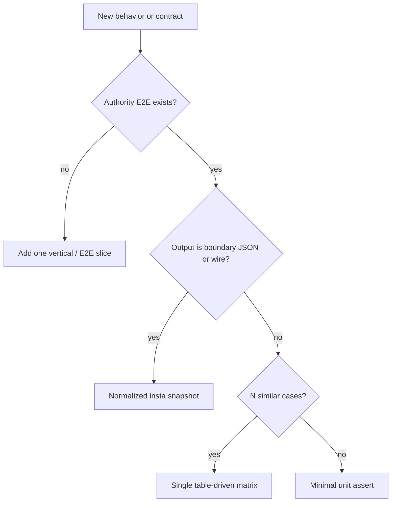

# Testing Handbook

**Canonical test strategy** for this repo (`docs/assertions/`). The goal is to
exercise systems the way real users (and unreliable networks) do. Happy paths
are nice, adversarial slices keep us honest. This is a living document: update
it as code evolves and use the examples below as patterns to adapt, not fixed
recipes.

**Enforcement:** PR review and pre-commit culture treat this document as normative.
New tests must match the [priority order](#test-strategy-enforced-priorities) below;
[TDD-style unit shards](#de-prioritized-tdd-style-unit-shards) are not the default.

---

## Test strategy (enforced priorities)

Use this order when choosing **what evidence to add**. Higher tiers subsume lower
ones for the same behavior.

| Priority | Evidence type | When required |
|----------|---------------|---------------|
| **1** | **Authority E2E / vertical slice** | New user-visible behavior; one authoritative test per row in the [authority map](#test-authority-map-per-behavior) |
| **2** | **Boundary snapshot** (`insta`) | Wire shapes, graph exports, conversation/history JSON, discovery output — at **integration boundaries** only |
| **3** | **Matrix contract** (`*_matrix`, `json_snapshot_test!` rows) | Multiple inputs differing only by variant (parse, policy, error mapping, SSRF URL, header name) |
| **4** | **Property / adversarial** | Invariants, concurrency, malformed paths (`proptest!`, `a2a_malformed_and_error_paths_test.rs`) |
| **5** | **Targeted unit assert** | Only when no boundary exists (pure helper with no integration surface) |



### De-prioritized: TDD-style unit shards

**Do not** treat “one `#[test]` per case” as the default style. The following are
**discouraged** unless folded into a matrix or promoted to a boundary snapshot:

- Separate `#[test]` functions that differ only by input string, enum variant, or
  expected error variant (`rejects_*`, `allows_*`, `parse_*`, `round_trip_*` per shape).
- Tests whose only assertion is serde round-trip, getter/setter equality, or
  “construct struct → read field back” with no production contract.
- Duplicate coverage already listed under “Do not duplicate in” in the authority map.
- New `insta` snapshots **inside** `src/` for every serde type — snapshots belong at
  [integration boundaries](#boundary-snapshot-evidence-insta).

**Preferred replacements:** `foo_bar_matrix` with `case.label` in panics; one
`json_snapshot_test!` or `insta::assert_json_snapshot!` after normalization; authority
map row when consolidating.

### Required naming and review gates

| Gate | Rule |
|------|------|
| **Matrix name** | Table-driven contract tests end with `_matrix` (e.g. `cluster_endpoint_rejection_matrix`) |
| **Snapshot** | Boundary tests use `insta`; inputs normalized (fixed IDs, sorted rows, redacted secrets) |
| **Authority map** | Adding or deleting authoritative coverage updates the map in this file |
| **Inventory** | Before adding many `#[test]` in one file, run `just test-inventory` |
| **Insta PR** | Intentional snapshot changes require `cargo insta review` in the PR description |

---

## Testing Philosophy

- **Prefer vertical slices over unit shards.** Exercise the public API of the
  system under test (BAML runtime, A2A handlers, provenance writer, CLI entrypoint)
  and let real dependencies run. The only code that may be "test only" is
  fixture scaffolding (e.g. test support helpers, testcontainers, fixtures).
- **Use the test-support crate for shared fixtures.** Common setup helpers live
  in `crates/test-support` and are reused across tests to keep setup consistent.
- **Tests are contracts, not documentation.** Assertions should verify behavior
  that matters: specific outputs, error conditions, state transitions, and
  invariants (e.g. provenance normalization, tool registration, protocol flow).
- **Adversaries welcome.** For every happy path add malformed inputs, retries,
  and timing edge cases. Production bugs arrive from edges, not averages.
- **Make async behavior explicit.** Prefer `#[tokio::test]` for async surfaces,
  and keep concurrency controlled and deterministic where possible.
- **Matrices and boundary snapshots over TDD shards.** Variant-level contracts
  belong in one table or one normalized snapshot, not N copy-pasted `#[test]` fns.
  See [Matrix testing](#matrix-testing) and [Boundary snapshot evidence](#boundary-snapshot-evidence-insta).

---

## Test triage rubric

Label every test before adding or deleting coverage:

| Label | Action |
|-------|--------|
| **Authority E2E** | Keep — listed in the [authority map](#test-authority-map-per-behavior) below |
| **Property / adversarial** | Keep — `proptest!`, malformed-path suites |
| **Vertical slice** | Keep — multi-step flows through public APIs; trim duplicate assertions only |
| **Matrix candidate** | **Merge (required)** — N similar tests → one `cases: &[...]` loop or `json_snapshot_test!` row; name `*_matrix` |
| **Boundary snapshot** | **Keep / add** — integration-boundary `insta` with normalized input |
| **Reflection shard (TDD)** | **Delete or fold** — serde-only round-trips, getter mirrors, per-variant `#[test]`, parse→field with no contract |
| **Snapshot upgrade** | Promote — engineer-readable integration output → normalized `insta` at boundary |

Run `just test-inventory` for per-file `#[test]` counts when consolidating.

---

## Matrix testing

Canonical patterns live in **`baml-rt-provenance`** (copy these, do not invent parallel styles).

| Pattern | Reference |
|---------|-----------|
| Async JSON snapshot matrix | `crates/baml-rt-provenance/tests/surreal_snapshot_test.rs` — `json_snapshot_test!` from `test-support` |
| Table-driven error mapping | `crates/baml-rt-a2a/tests/error_mapping_test.rs` — `cases: &[(Input, Expected)]` + loop |
| Vocabulary exhaustiveness | `crates/baml-rt-provenance/tests/metamodel_consistency_test.rs` — `for kind in ALL_EVENT_KINDS` |
| Backend pairing | `crates/baml-rt-provenance/tests/effect_bus_tool_ops_test.rs` — same assertions, in-memory vs file store |
| FSM / JS cases | `crates/baml-rt-quickjs/tests/execution_session_fsm_test.rs` — `Case { name, ... }` slice |

**Shared fixtures:** `test_support::testing::provenance_fixtures` (bootstrap, deterministic IDs, isolated Surreal store). Re-export of `test_surreal_store()` remains on `test_support::common`.

**When not to matrix:** authority E2E, property tests, or tests where failure isolation requires separate `#[test]` names in CI (rare — prefer `case.name` in panic messages).

**Do not add `rstest`** — hand-rolled tables match provenance and avoid a new dependency.

**Security / policy blocklists** (SSRF, MCP URL policy, reserved headers): always a single
`*_matrix` in the owning module — see `cluster_endpoint_rejection_matrix`,
`http_mcp_target_policy_matrix`, `mcp_static_header_policy_matrix`.

### Authority map update template

When consolidating tests, update the authority map row:

| Behavior | Authoritative location | Subsumes (deleted) |
|----------|-------------------------|-------------------|
| _example: citation parse contract_ | `baml-rt-citation/src/lib.rs` — `citation_parse_and_try_new_matrix` | `parse_history_ref`, `parse_archive_ref_*`, … |

---

## Test Layout and Fixtures

### Where Tests Live

- Crate-level tests: `crates/*/tests/*.rs`
- Shared fixtures: `tests/fixtures/` (agent fixtures under `tests/fixtures/agents/`)
- Test utilities: `crates/test-support`

### Fixture Helpers (test-support)

Use `crates/test-support` for setup and fixtures rather than duplicating logic:

- `setup_baml_runtime_default()` and `setup_baml_runtime_from_fixture()` for runtime setup
- `setup_bridge()` for QuickJS bridge setup
- `agent_fixture()` and `fixture_path()` for fixture files
- **`ensure_fixture_runtime_types()`** — call at the start of any E2E test that loads from
  `tests/fixtures/agents/` (e.g. `agent_fixture("stream-baml-tool")` or `setup_baml_runtime_from_fixture(...)`).
  Ensures fixture runtime types are regenerated once per test process before use.
- `require_api_key()` to gate tests that require `OPENROUTER_API_KEY`
- `ensure_baml_src_exists()` to skip tests when `baml_src` is missing
- **`test_support::testing::provenance_fixtures`** — `build_isolated_store`, `bootstrap_task`, `complete_task`, `wall_clock_tick`, fixed test agent/context helpers
- **`test_support::json_snapshot_test!`** — async provenance-style snapshot tests (setup + query + insta)

**Surreal parallelism:** in-memory provenance tests can flake under parallel `cargo test`; prefer `cargo nextest` or isolated stores (`build_isolated_store` / `test_surreal_store`). See `episode_reader_integration.rs` module docs.

---

## Authoritative E2E and Test Layers

We keep **one authoritative E2E per behavior** to avoid overlapping coverage and flaky duplicates.

### E2E Authority (single source of truth)

- **Streaming E2E (full agent → stream):**
  `crates/baml-agent-runner/tests/runner_test.rs`
  - `test_e2e_stream_baml_tool`, `test_e2e_stream_js_tool` — full runner + fixture package + stream.
- **Slack source ingress dispatch E2E (raw Slack source → downstream route):**
  `crates/baml-agent-runner/tests/runner_slack_source_ingress_test.rs`
  - `slack_source_ingress_dispatch_http_routes_raw_slack_source_records_to_task_management_creation_capability` — authoritative for `slack-agent` HTTP dispatch routing from raw Slack source records to downstream task-management delegation.
  - `slack_inbox_producer_delivers_durable_ingress_to_slack_agent_and_downstream_delegation` — runner inbox drain → slack-agent source ingress → downstream delegation (REST channel polling E2E is in `task-daemon` tests).
  - `slack_source_ingress_dispatch_http_rejects_noncanonical_raw_source_routing_key` — authoritative for the raw-source routing-key guard on the slack-agent dispatch surface.
- **Tool/LLM E2E (single request):**
  `crates/baml-rt/tests/tool_calling_test.rs`
  - `test_e2e_voidship_baml_tool_calling` — single-request tool E2E from fixture.
- **Tool/LLM E2E (concurrent):**
  `crates/baml-rt/tests/tool_calling_test.rs`
  - `test_e2e_voidship_baml_tool_calling_concurrent` — concurrent tool calls with per-request scope;
  authoritative for concurrency correctness (per-conversation scope, no cross-contamination).

### Integration (non–full E2E)

- **A2A streaming protocol:** `crates/baml-rt-a2a/tests/task_streaming_test.rs` — protocol semantics,
  tool-call flows, subscribe; not full runner binary.
- **QuickJS scope propagation:** `crates/baml-rt-quickjs/tests/bridge_test.rs` — scope attribution
  under concurrency, tool session plans.

### Property tests (invariants)

- **Scope attribution:** `crates/baml-rt-a2a/tests/provenance_property_test.rs` — no cross-contamination
  of `context_id` across concurrent requests.
- **Tool session lifecycle:** `crates/baml-rt-quickjs/tests/tool_session_property_test.rs` — valid
  session plans (open → send* → next → finish) complete consistently.
- **Stream chunk order and finality:** `crates/baml-rt-a2a/tests/stream_property_test.rs` — yielded
  chunks preserve order; exactly one chunk is final.

### Concurrency coverage

- **E2E:** `test_e2e_voidship_baml_tool_calling_concurrent` (baml-rt) — multiple requests with
  distinct agent/context IDs; each request’s result must match its inputs (no cross-talk).
- **Integration:** `test_context_id_is_task_local_under_concurrency` (baml-rt-a2a provenance_context_test),
  `test_quickjs_concurrent_scope_propagation` (bridge_test) — scope and provenance attribution.
- **Property:** `prop_scope_attribution_no_cross_contamination` (provenance_property_test) — any
  N concurrent requests with distinct context_ids produce events only for those context_ids.

### Malformed and error-path E2E

All live in `crates/baml-rt-a2a/tests/a2a_malformed_and_error_paths_test.rs`. Purpose: verify invalid
JSON-RPC input and runtime error paths produce the expected error responses or stream content.

- **Malformed JSON-RPC:** `test_malformed_a2a_invalid_jsonrpc_version`, `test_malformed_a2a_unsupported_method`, `test_malformed_a2a_invalid_params` — wrong version, unsupported method, or invalid params yield a single error response.
- **Allowlist during streaming:** `test_allowlist_violation_during_stream` — JS opens a tool not in the runtime allowlist; stream must contain allowlist error.
- **Streaming tool failure:** `test_streaming_tool_failure_mid_stream` — tool returns `Err` mid-stream; stream must contain error content.
- **Concurrency mixed success/failure:** `test_concurrency_mixed_success_failure` — valid and malformed requests run concurrently; valid succeed, malformed return error.

### Test authority map (per-behavior)

Single source of truth for each behavior; do not add overlapping coverage elsewhere.

| Behavior | Authoritative location | Do not duplicate in |
|----------|-------------------------|---------------------|
| Slack source ingress raw-source routing, inbox delivery, and routing-key guard | `baml-agent-runner/tests/runner_slack_source_ingress_test.rs` — `slack_source_ingress_dispatch_http_routes_raw_slack_source_records_to_task_management_creation_capability`, `slack_inbox_producer_delivers_durable_ingress_to_slack_agent_and_downstream_delegation`, `slack_source_ingress_dispatch_http_rejects_noncanonical_raw_source_routing_key` | Additional runner tests re-covering the same raw-Slack source-ingress contract elsewhere |
| Schema/function discovery | `baml-rt/tests/invoke_test.rs` — `test_load_schema_discovers_functions` | `execution_test.rs` or other invoke tests |
| SimpleGreeting invocation (direct runtime) | `baml-rt/tests/invoke_test.rs` — `test_invoke_simple_greeting`; `execution_test.rs` — `test_load_and_execute_simple_greeting` (superset: list + invoke) | Additional tests that only assert “invoke SimpleGreeting” via same API |
| Tool result contract (no success wrapper, steps/result shape) | `baml-rt/tests/contracts_test.rs` — one direct BAML path, one JS-wrapper path | Extra contract tests with same setup and same assertions |
| Streaming chunk semantics (statusUpdate, artifactUpdate) | `baml-rt-a2a/tests/task_streaming_test.rs` — protocol-level | `runner_test.rs` E2E (assert wiring/operability only, not chunk shape) |
| Full streaming E2E (runner + package + stream) | `baml-agent-runner/tests/runner_test.rs` — `test_e2e_stream_baml_tool`, `test_e2e_stream_js_tool` | Additional full-runner streaming tests |
| Single-request tool E2E (ChooseCalcTool, execute) | `baml-rt/tests/tool_calling_test.rs` — `test_e2e_voidship_baml_tool_calling` | Other crates re-covering same vertical slice |
| Concurrent tool E2E (per-scope, no cross-talk) | `baml-rt/tests/tool_calling_test.rs` — `test_e2e_voidship_baml_tool_calling_concurrent` | Duplicate concurrency E2E |
| Citation ref parse / try_new contract | `baml-rt-citation/src/lib.rs` — `citation_parse_and_try_new_matrix` | `baml-rt-tools` parse shards; per-variant `parse_*` fns |
| Citation resolve + validation contract | `baml-rt-tools/src/citations.rs` — `citation_validation_matrix`, `resolved_citation_matrix` | Per-variant `validate_*` / `resolve_*` unit fns |
| RefTable archive insert / monotonic `@N` | `baml-rt-tools/src/archive_refs.rs` — `ref_table_archive_lifecycle_matrix` | `insert_and_get`, `refs_are_monotonic`, `get_unknown_ref_*` |
| Archive entry display headers | `baml-rt-tools/src/archive_refs.rs` — `archive_display_header_matrix` | Per-shape `display_header_*` fns |
| MCP servers file parse rejections | `baml-rt-tools/src/mcp_config.rs` — `mcp_config_parse_rejection_matrix` | Per-error `rejects_*` fns |
| MCP schema opaque fallback | `baml-rt-tools/src/mcp_schema_normalize.rs` — `opaque_fallback_feature_matrix` | `complex_oneof_*`, `nested_unsupported_*` duplicates |
| Prompt projection transcript + replay | `baml-rt-tools/src/prompt_projection.rs` — `format_conversation_history_transcript_matrix`, `send_done_replay_read_matrix`, `empty_history_filters_send_done_matrix` | Per-scenario transcript / replay shards |
| Archive read wire types | `baml-rt-tools/src/archive_read/types.rs` — `archive_read_types_matrix` | Per-field serde round-trip fns |
| `deserialize_vec_or_one` serde | `baml-rt-core/src/serde_one_or_many.rs` — `deserialize_vec_or_one_matrix` | `optional_*` / `required_*` shard fns |
| Retry-After header parse | `baml-rt-core/src/retry_after.rs` — `parse_retry_after_matrix` | `missing_header_*`, `integer_seconds_*`, … |
| Exponential / rate-limit backoff | `baml-rt-core/src/backoff.rs` — `backoff_schedule_matrix` | `backoff_delay_*`, `exponential_backoff_*` shards |
| Cluster endpoint SSRF blocklist (literal URL) | `baml-rt-router/src/ssrf.rs` — `cluster_endpoint_rejection_matrix`, `cluster_endpoint_allowance_matrix` | Per-URL `rejects_*` / `accepts_*` shards; expanding runner E2E URL list to mirror full blocklist |
| Cluster endpoint DNS resolve guard | `baml-rt-router/src/ssrf.rs` — `resolve_and_validate_cluster_endpoint_matrix` | Duplicate `resolve_rejects_*` / `resolve_accepts_*` shards |
| MCP HTTP URL policy (pre-connect) | `baml-rt-mcp/src/http/policy.rs` — `http_mcp_target_policy_matrix` | Per-scenario `rejects_*` / `allows_*` in policy module |
| MCP static header injection guard | `baml-rt-mcp/src/http/headers.rs` — `mcp_static_header_policy_matrix` | Per-header `rejects_reserved_*` shards |
| Control migrate SSRF wiring (sample URLs) | `baml-agent-runner/tests/runner_cluster_test.rs` — `migrate_rejects_ssrf_targets` | Duplicating full router blocklist in E2E; per-URL unit shards in `ssrf.rs` |
| Archive JSON render contract | `baml-rt-tools/src/archive_read/render.rs` — `render_to_lines_matrix` | `scalar_*`, `empty_*`, per-shape render fns |
| StreamChunkView task_id extraction | `baml-rt-a2a/src/a2a_types.rs` — `stream_chunk_view_task_id_matrix` | `stream_chunk_view_parses_task_id_*` |
| User speaker classification | `baml-rt-conversation/src/view.rs` — `classify_user_speaker_kind_matrix` | `classify_*` per-scenario fns |
| Execution-session wire format | `baml-rt-quickjs/src/execution_session_types.rs` — `execution_session_commands_wire_snapshot`, `execution_session_command_round_trip_matrix` | Per-variant `snapshot_*` fns |
| BAML error → tool disposition | `baml-rt-tools/src/tool_error_classify.rs` — `classified_tool_error_matrix` | `tool_execution_core_default_*`, `invalid_argument_*` |
| Deployment store lifecycle | `baml-agent-runner/src/deployment_state.rs` — `deployment_store_lifecycle_matrix` | `opens_and_lists_empty`, `save_and_remove_roundtrip` |
| MCP snapshot wire shape | `baml-rt-tools/src/mcp_snapshot.rs` — `mcp_snapshot_wire_matrix`, `mcp_wire_variant_round_trip_matrix` | `round_trip_minimal_*`, `approval_variants_*`, `output_mode_variants_*`, `transport_ref_variants_*` |
| Discovery introspection/extrospection output+scope insta | `baml-tools-system/tests/discovery_sessions_test.rs` — `discovery_session_output_and_scope_snapshot_matrix` | `introspection_session_snapshots_*`, `extrospection_session_snapshots_cross_scope_request` |
| Exported graph shape (sequence flow) | `baml-rt-provenance/tests/graph_export_sequence_integration_test.rs` — `file_backed_export_renders_expected_sequence_flow` (uses `test_support::testing` graph assertions) | Ad-hoc node/edge counts only |

### Do-not-duplicate checklist

Before adding a test that touches any of the following, check the authority map above and **do not** add duplicate coverage in the “Do not duplicate in” locations:

- **Function discovery** — authority: `invoke_test.rs::test_load_schema_discovers_functions`. Do not add the same assertion in `execution_test.rs` or elsewhere.
- **Streaming chunk semantics** (statusUpdate, artifactUpdate) — authority: `task_streaming_test.rs`. Runner E2E tests should assert wiring/operability only, not chunk shape.
- **Tool result contract** (no success wrapper, steps/result shape) — authority: `contracts_test.rs` (one direct BAML path, one JS-wrapper path). Do not add extra contract tests with the same setup and assertions.
- **SimpleGreeting entry-point coverage** — authority: `invoke_test.rs` and `execution_test.rs`. Do not add further tests that only assert “invoke SimpleGreeting” via the same API.

---

## Integration and E2E Tests

### Use the Real API Surface

- Call the same functions that production code uses. Do **not** reach into
  `#[cfg(test)]` helpers to bypass validation or internal state.
- Seed data through production APIs, not internals. If you need a helper, add it
  to `crates/test-support` and call production surfaces from there.
- Prefer `BamlRuntimeManager`, `QuickJSBridge`, `A2aRequestHandler`, and
  provenance writers as the main entry points.

### External Services

Some tests use real infrastructure:

- Provenance tests in `crates/baml-rt-provenance/tests/` use in-memory SurrealDB
  or file-backed stores; no external graph server required.

---

## Boundary snapshot evidence (insta)

**Boundary snapshots are first-class evidence** (priority **2** in the
[strategy table](#test-strategy-enforced-priorities)). They document what crosses a
real boundary: HTTP responses, provenance graph shape, A2A conversation history,
execution-session wire, discovery session output.

High-level integration tests use **`insta`** so PR diffs double as engineer-facing
contracts. Prefer snapshots at **integration boundaries** (provenance ops,
conversation history, HTTP API JSON, execution-session wire), **not** for every
serde round-trip in `src/`.

**When a boundary snapshot is required**

- New or changed **wire JSON** consumed by another crate, UI, or external client.
- **Graph / provenance** shape assertions beyond simple counts (use normalized export).
- **Multi-field** outputs where a matrix would be unreadable — use one snapshot + matrix
  for error variants only.

**When a matrix is enough (no new snapshot)**

- Enumerated reject/allow cases with small structured errors (policy, parse, SSRF).
- Error mapping where variant name + one field is the whole contract.

| Crate / area | Snapshot location | Canonical example |
|--------------|-------------------|-------------------|
| Provenance | `crates/baml-rt-provenance/tests/snapshots/` | `surreal_snapshot_test.rs`, `store_test.rs` (Mermaid) |
| HTTP API | `crates/baml-rt-api/tests/snapshots/` | `api_test.rs` |
| A2A conversation | `crates/baml-rt-a2a/tests/snapshots/` | `conversation_history_snapshot.rs` |
| QuickJS wire | `crates/baml-rt-quickjs/src/snapshots/` | `execution_session_types.rs` — `execution_session_commands@wire` |

**Workflow:**

```bash
cargo test -p <crate> --test <integration_test>
cargo insta review
```

**Normalization before snapshot:** strip timestamps, sort unstable rows, use fixed
IDs from `provenance_fixtures`. For non-`Serialize` domains, build a structural
`serde_json::Value` summary (see `store_test.rs`).

Keep snapshot inputs deterministic to avoid noisy churn.

---

## Adversarial Testing

- For every new feature, brainstorm how it fails: duplicate requests, malformed
  inputs, replayed messages, stale graph state, unexpected tool payloads.
- When writing an “expected” success test, ask: _What happens if we swap this
  ID, if two clients race, if the runtime returns a partial result?_ Add those
  cases.
- Favor explicit assertions that explain _why_ the behavior is required.

---

## Invariants and Behavior Contracts

Invariants should be encoded as direct assertions in tests, and where appropriate as
**property tests** (e.g. `proptest`), especially in:

- Provenance normalization and relation derivation
  (`crates/baml-rt-provenance/tests/normalizer_test.rs`)
- Provenance persistence and graph shape
  (`crates/baml-rt-provenance/tests/store_test.rs`)
- Tool registration and execution correctness
  (`crates/baml-rt/tests/tool_calling_test.rs`)
- **Scope attribution:** property test that no provenance event has a `context_id` from a
  different request (`provenance_property_test::prop_scope_attribution_no_cross_contamination`).
- **Tool session lifecycle:** property test that valid session plans complete
  (`tool_session_property_test::prop_valid_session_plans_complete`).
- **Stream order and finality:** property test that K chunks yield K responses in order and
  exactly one final (`stream_property_test::prop_stream_chunk_order_and_finality`).

### How to Discover New Invariants

- **Start from the contract.** Walk the public API surface and ask: _what must
  be true before and after every call?_
- **Trace data flow across boundaries.** Follow a request through layers
  (runtime → bridge → tool execution → provenance).
- **Interrogate failure modes.** Review TODOs and past failures; turn them into
  assertions.
- **Consider conservation and exclusivity.** Look for quantities or relationships
  that must never be violated (single tool registration, unique IDs, graph edge
  consistency).

### Capturing the Invariants

1. **Name them explicitly.** Document each invariant inside the test module.
2. **Encode with helpers.** Wrap complex checks in reusable assertion functions.
3. **Add negative examples.** Create failing fixtures where useful.
4. **Keep invariants living.** Update them when behavior evolves.

---

## Concurrency and Async Testing

Most async tests use `#[tokio::test]`. When adding concurrency:

- Keep the test deterministic by controlling inputs and expected outcomes.
- Prefer explicit synchronization (`join!`, `try_join!`, and task joins).
- Ensure shared resources are not leaked between tests (fixtures are scoped per test).

---

## Example Playbook

1. **Integration test a new runtime feature.**
   - Use `setup_baml_runtime_default()` or `setup_baml_runtime_from_fixture()`.
   - Drive the public runtime APIs; no internal shortcuts.
   - Add both happy path and adversarial inputs.

2. **Provenance change.**
   - Update normalization tests and store tests.
   - Add or adjust `insta` snapshots if the graph shape changes.

3. **New tool or bridge behavior.**
   - Register the tool via `BamlRuntimeManager`.
   - Verify execution and JS bridge registration via `QuickJSBridge`.

---

## Quick Checklist Before Shipping

- Does the test call only production APIs (fixtures aside)?
- Is this the **authority** location for the behavior (or an explicit matrix row), not a duplicate shard?
- If adding variant coverage: is it a **`*_matrix`** or **boundary `insta`**, not a new TDD-style `#[test]` per case?
- Are failure cases covered, not just success (matrix reject rows or adversarial suite)?
- Are snapshots **boundary-level**, deterministic, and reviewed with `cargo insta review`?
- Does the [authority map](#test-authority-map-per-behavior) list this test if it is the sole source of truth?
- Are async/concurrency behaviors explicitly asserted?
- Are shared fixtures and external services properly scoped and cleaned up?

Following these practices keeps the test suite reliable as the codebase evolves.
