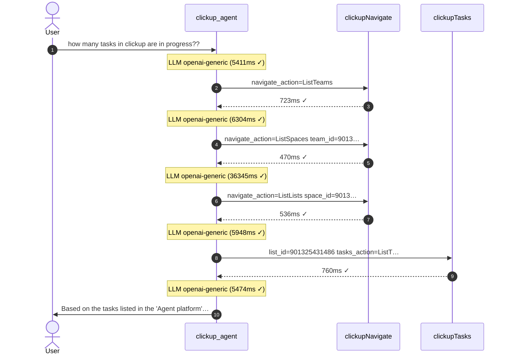

# Graph Exporter

The graph exporter is a CLI tool that reads provenance data from a SurrealDB
database and renders agent conversation graphs in multiple output formats. It
lives in `crates/baml-rt-provenance/src/bin/graph_exporter.rs`.

## Quick Start

Requires a SurrealDB database directory with provenance data (the agent runner
writes to it when started with `--provenance-db <path>`).

Example runner invocation with file-backed provenance:

```sh
cargo run -p baml-agent-runner -- \
  <agent-package>.tar.gz --a2a-stdio --provenance-db provenance.db
```

```sh
cargo run -p baml-rt-provenance --features cli --bin graph_exporter -- \
  --db provenance.db \
  --context-id ctx-1771210416700-2 \
  --simplify \
  --format mermaid > conversation.mmd
```

This reads the given database, exports the provenance graph for the context,
simplifies it (dedup edges, collapse start/complete pairs, filter
infrastructure nodes, temporal sort), and renders a Mermaid sequence diagram
to `conversation.mmd`.

## Example Output

The `mermaid` format produces a sequence diagram showing the full agent
conversation flow — user messages, LLM reasoning steps, tool calls, and agent
responses — in chronological order:



How to read the diagram:
- **Solid arrows** (`->>`) are messages: user→agent requests and agent→user responses.
- **Dashed arrows** (`-->>`) are tool returns: tool→agent results.
- **Notes** are internal LLM reasoning steps with model, latency, and success/failure.
- **Autonumbering** shows the chronological order of events.

## Output Formats

### Mermaid (default)

Renders a `sequenceDiagram` with autonumbering. This is the primary format for
understanding agent conversations at a glance.

Node type mapping:
- **User messages** → `User->>Agent: content preview`
- **Agent responses** → `Agent->>User: content preview`
- **LLM calls** → `Note over Agent: LLM model (duration ✓/✗)`
- **Tool calls** → `Agent->>Tool: args summary` / `Tool-->>Agent: duration ✓/✗`

Participants are auto-discovered from the graph. Infrastructure agents
(`runner`, `client`) are filtered out. Tool names have the `support/` prefix
stripped for readability.


The `.mmd` output can be rendered by:
- GitHub/GitLab markdown (paste inside a ```` ```mermaid ```` block)
- [Mermaid Live Editor](https://mermaid.live)
- VS Code with the Mermaid extension
- Any tool that supports Mermaid.js

### DOT

Renders a Graphviz DOT graph showing the full node/edge structure. Useful for
visualizing the provenance graph topology (structural relationships) rather
than the temporal conversation narrative.

Supports additional options:
- `--edge-labels` (default: true) — show relationship labels on edges
- `--group` — cluster nodes by type into subgraphs
- `--direction` — graph direction: `td`, `lr`, `bt`, `rl`

```sh
cargo run -p baml-rt-provenance --features cli --bin graph_exporter -- \
  --context-id <ID> --simplify --format dot --group | dot -Tpng -o graph.png
```

Requires [Graphviz](https://graphviz.org/) installed for rendering to
SVG/PNG/PDF. Scales better than Mermaid for large graphs (hundreds of nodes).

### JSON

Exports the raw `ExportedGraph` structure (nodes, edges, properties) as JSON.
Useful for programmatic consumption, custom renderers, or feeding into frontend
libraries like React Flow, Cytoscape.js, or D3.

```sh
cargo run -p baml-rt-provenance --features cli --bin graph_exporter -- \
  --context-id <ID> --simplify --format json | jq .
```

The JSON contains `nodes` (with `id`, `label`, `display_name`, `properties`,
`event_order`) and `edges` (with `from`, `to`, `relation`, `properties`).

## Scope Selection

Exactly one scope must be specified:

- `--context-id <ID>` — export a single conversation context (most common)
- `--task-id <ID>` — export all nodes related to a specific A2A task
- `--full` — export the entire graph (can be large; use for debugging only)

## Simplification

The `--simplify` flag applies several transformations to reduce visual noise:

- Collapses LLM start/complete node pairs into a single node (keeps the
  completed node's properties: model, duration, success)
- Removes `LlmPrompt` nodes (the LLM call node already captures the relevant
  info; prompts are too large for diagram display)
- Collapses tool FSM phases (open→send→next→finish) into a single node per
  tool invocation, keeping only the send-complete phase
- Deduplicates edges between the same node pairs
- Filters out infrastructure agent nodes (`runner`, `client`)
- Sorts nodes by `event_order` for temporal coherence

Without `--simplify`, you get the raw provenance graph which includes every
intermediate node and edge recorded during execution. This is useful for
debugging provenance issues but produces noisy diagrams.

## Connection Options

- `--db <PATH>` — Path to SurrealDB database directory (default: `provenance.db`).
  `:memory:` is process-local and not usable for cross-process export.
  Ensure runner was started with `--provenance-db <PATH>`.
- `--output <PATH>` — write to file instead of stdout

## Examples

Export a conversation as a Mermaid diagram and save to file:
```sh
cargo run -p baml-rt-provenance --features cli --bin graph_exporter -- \
  --context-id ctx-1771210416700-2 --simplify --format mermaid -o conversation.mmd
```

Export the raw (unsimplified) graph as JSON for debugging:
```sh
cargo run -p baml-rt-provenance --features cli --bin graph_exporter -- \
  --context-id ctx-1771210416700-2 --format json | jq '.nodes | length'
```

Export a task-scoped graph as DOT and render to PNG:
```sh
cargo run -p baml-rt-provenance --features cli --bin graph_exporter -- \
  --task-id cli-task-ctx-1771210416700-2 --simplify --format dot \
  | dot -Tpng -o task_graph.png
```
