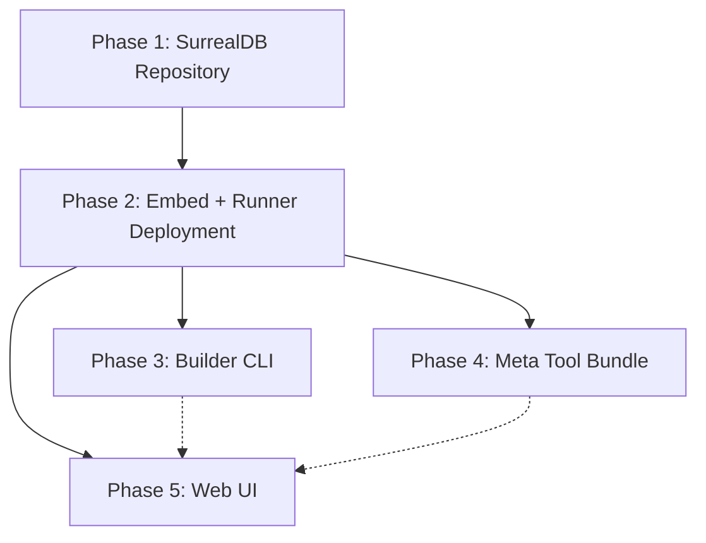

# Repository Integration

## Doctrinal Principles

1. **The repository is a pure archive.** It stores agent packages, metadata, lineage, fitness, tags, and search. It knows nothing about deployment. Multiple runtimes can share the same repository.
2. **Deployment is a runtime concern.** The runner owns its own deployment state -- which agents are running, when they were deployed, drain status. This state is persisted locally by the runner (not in the repository).
3. **SurrealDB from day one.** The repository backend is SurrealDB embedded (greenfield). SQLite is removed entirely from the repository crate. No migration path, no dual-backend, no feature flags.
4. **Every running agent has repository provenance.** Content hash, version, generation, lineage, tags -- all surfaced in discovery, API, and tools.

## Current State

`baml-rt-repository` exists with clean trait boundaries ([storage.rs](crates/baml-rt-repository/src/storage.rs)), a `RepositoryService` facade ([service.rs](crates/baml-rt-repository/src/service.rs)), and HTTP routes ([router.rs](crates/baml-rt-repository/src/router.rs)). Backend is currently SQLite + FS. **NOT wired** into the runtime.

The runner loads agents from tar.gz via CLI args ([builder.rs](crates/baml-agent-runner/src/builder.rs): `Loading -> Ready`). `BootedAgent` has no repository identity. `AgentCard` has no hash/version/generation.

## What Gets Removed

- `Cli.packages: Vec<PathBuf>` from [main.rs:1059-1062](crates/baml-agent-runner/src/main.rs)
- `RunnerConfig.packages: Vec<PathBuf>` from [main.rs:1044](crates/baml-agent-runner/src/main.rs)
- `RunnerBuilder<Loading>::load_agent()` from [builder.rs:60-105](crates/baml-agent-runner/src/builder.rs)
- The `main()` loop iterating `config.packages`
- The `--invoke` mode (already exists as `baml-agent-builder run`)
- [sqlite_store.rs](crates/baml-rt-repository/src/sqlite_store.rs) -- replaced by SurrealDB
- [fs_blob_store.rs](crates/baml-rt-repository/src/fs_blob_store.rs) -- SurrealDB stores blobs natively
- `rusqlite` dependency from `baml-rt-repository/Cargo.toml`

---

## Phase 1: SurrealDB Repository Backend (Greenfield)

**Goal**: Replace SQLite + FS backend with SurrealDB embedded. Clean cut -- no dual backend.

### 1a. Add SurrealDB dependency

Replace `rusqlite` with `surrealdb` in [Cargo.toml](crates/baml-rt-repository/Cargo.toml):

```toml
[dependencies]
surrealdb = { version = "2", features = ["kv-rocksdb"] }
# Remove: rusqlite
```

### 1b. New `surreal_store.rs` -- single struct implements all four traits

```rust
pub struct SurrealStore {
    db: Surreal<Db>,
}

impl SurrealStore {
    pub async fn open(path: &Path) -> Result<Self> {
        let db = Surreal::new::<RocksDb>(path).await?;
        db.use_ns("baml").use_db("repository").await?;
        Self::init_schema(&db).await?;
        Ok(Self { db })
    }

    pub async fn open_in_memory() -> Result<Self> {
        let db = Surreal::new::<Mem>(()).await?;
        db.use_ns("baml").use_db("repository").await?;
        Self::init_schema(&db).await?;
        Ok(Self { db })
    }
}

#[async_trait] impl MetadataStore for SurrealStore { /* ... */ }
#[async_trait] impl LineageStore for SurrealStore { /* ... */ }
#[async_trait] impl SearchStore for SurrealStore { /* ... */ }
#[async_trait] impl BlobStore for SurrealStore { /* ... */ }
```

SurrealDB is multi-model -- one store handles records, graph relations, blobs, and FTS.

### 1c. SurrealDB schema

```surql
-- Agent entries (core metadata)
DEFINE TABLE entries SCHEMAFULL;
DEFINE FIELD hash ON entries TYPE string ASSERT $value != NONE;
DEFINE FIELD agent_name ON entries TYPE string;
DEFINE FIELD version ON entries TYPE int;
DEFINE FIELD generation ON entries TYPE int;
DEFINE FIELD parentage_json ON entries TYPE string;
DEFINE FIELD source_json ON entries TYPE string;
DEFINE FIELD change_rationale ON entries TYPE string;
DEFINE FIELD created_at ON entries TYPE string;
DEFINE FIELD manifest_description ON entries TYPE option<string>;
DEFINE FIELD manifest_tools ON entries TYPE array<string>;
DEFINE FIELD manifest_capabilities ON entries TYPE array<string>;
DEFINE FIELD tags ON entries TYPE array<string>;        -- tags stored inline (no join table)
DEFINE INDEX idx_hash ON entries FIELDS hash UNIQUE;
DEFINE INDEX idx_name_version ON entries FIELDS agent_name, version UNIQUE;

-- Full-text search
DEFINE ANALYZER repo_fts TOKENIZERS blank, class FILTERS snowball(english);
DEFINE INDEX entries_fts ON entries
    FIELDS agent_name, source_text, manifest_text
    SEARCH ANALYZER repo_fts;

-- Lineage as graph relations (replaces lineage_edges table + recursive CTEs)
DEFINE TABLE derives_from SCHEMAFULL TYPE RELATION IN entries OUT entries;
DEFINE FIELD kind ON derives_from TYPE string ASSERT $value IN ['fork', 'influence'];
DEFINE FIELD description ON derives_from TYPE string;

-- Fitness scores (append-only)
DEFINE TABLE fitness_scores SCHEMAFULL;
DEFINE FIELD entry_hash ON fitness_scores TYPE string;
DEFINE FIELD domain ON fitness_scores TYPE string;
DEFINE FIELD score ON fitness_scores TYPE float;
DEFINE FIELD recorded_at ON fitness_scores TYPE string;
DEFINE INDEX idx_fitness_hash ON fitness_scores FIELDS entry_hash;

-- Blobs (tar.gz binary stored directly)
DEFINE TABLE blobs SCHEMAFULL;
DEFINE FIELD hash ON blobs TYPE string;
DEFINE FIELD data ON blobs TYPE bytes;
DEFINE INDEX idx_blob_hash ON blobs FIELDS hash UNIQUE;
```

Key advantages over SQLite:

- **Lineage traversal**: `SELECT <-derives_from.* FROM entries:$hash` -- native graph walk, no recursive CTEs
- **Tags inline**: array field on entries, no join table needed
- **Blobs native**: `bytes` type, no separate filesystem layer
- **FTS built-in**: `DEFINE ANALYZER` + `SEARCH` index with snowball stemmer

### 1d. Delete SQLite/FS implementations

Remove:

- `sqlite_store.rs`
- `fs_blob_store.rs`

Update `lib.rs` re-exports: replace `SqliteStore` + `FsBlobStore` with `SurrealStore`.

### 1e. Update tests

All tests currently use `SqliteStore::open_in_memory()` + `tempfile`. Convert to `SurrealStore::open_in_memory()`. The trait-based test structure means the test logic stays the same -- only the store construction changes.

---

## Phase 2: Embed Repository + Runner-Owned Deployment

**Goal**: Wire repository into runner. Deployment state owned by the runner (not the repository). On startup, restore deployed agents from runner's local state.

### 2a. Runner deployment state (runner-local, NOT in repository)

The runner persists its own deployment set in a small local store (SurrealDB or a simple JSON file alongside the provenance DB). This is conceptually separate from the repository:

```rust
/// Runner-local deployment record. NOT part of the repository.
pub(crate) struct DeploymentRecord {
    pub content_hash: String,
    pub agent_name: String,
    pub deployed_at: String,
}
```

Simple persistence options (in order of preference):

- **SurrealDB table** in the runner's own embedded DB (separate from the repository DB) -- consistent with the overall SurrealDB direction - this should be provenant as always, and keep a linked graph of all deployments (the entity here is AgentPackage, activity for deployment)

Operations: `save_deployment()`, `remove_deployment()`, `list_deployments()`.

### 2b. Enrich `BootedAgent` with repository identity

```rust
pub(crate) struct BootedAgent {
    agent: A2aAgent,
    manifest: AgentManifest,
    baml_functions: Vec<String>,
    content_hash: ContentHash,
    version_ref: VersionRef,
    generation: Generation,
    tags: Vec<Tag>,
    deployed_at: String,
}
```

### 2c. Enrich `AgentCard` with repository metadata

Add to [agent_routing.rs:122](crates/baml-rt-core/src/agent_routing.rs):

```rust
pub struct AgentCard {
    // ... existing fields ...
    #[serde(skip_serializing_if = "Option::is_none")]
    pub content_hash: Option<String>,
    #[serde(skip_serializing_if = "Option::is_none")]
    pub repository_version: Option<u32>,
    #[serde(skip_serializing_if = "Option::is_none")]
    pub generation: Option<u32>,
    #[serde(default, skip_serializing_if = "Vec::is_empty")]
    pub tags: Vec<String>,
}
```

Mirror in `AgentCardDto` ([openapi.rs:19](crates/baml-rt-api/src/openapi.rs)) and system tool `AgentCardDto` ([tools.rs:143](crates/tools/system/src/tools.rs)).

### 2d. Runner initialization -- repository replaces tar.gz

Remove `packages: Vec<PathBuf>` from CLI. Add `--repository-dir <DIR>`.

Startup:

1. Open SurrealDB repository at `--repository-dir`
2. Construct `Arc<RepositoryService>`
3. Load runner deployment state (local)
4. For each deployed hash: `repository.get_blob(hash)` -> extract -> 4-phase boot -> insert
5. Start HTTP / stdio

### 2e. Refactor `RunnerBuilder` -- remove Loading/Ready distinction

The runner is always ready. `deploy_from_repository()` and `undeploy()` are methods on `AgentRunner` directly, usable both at startup and at runtime:

```rust
impl AgentRunner {
    pub async fn deploy_from_repository(&self, hash: &ContentHash) -> Result<AgentRouteKey> { /* ... */ }
    pub async fn undeploy(&self, key: &AgentRouteKey) -> Result<()> { /* ... */ }
}
```

### 2f. HTTP API for deployment lifecycle

- `POST /deploy` -- body: `{ "hash": "..." }` or `{ "name": "...", "version": N }` -- deploys from repository
- `POST /undeploy` -- body: `{ "agent_package": "..." }` -- graceful drain + remove
- `GET /deployments` -- list running agents with full repository metadata

These are **runner endpoints** (not under `/repository`), because deployment is a runner concern.

### 2g. Mount repository router under `/repository`

In [router.rs](crates/baml-rt-api/src/router.rs), nest the repository's own routes:

```rust
router = router.nest("/repository", repository_router(repo_svc.clone()));
```

### 2h. Add blob upload/download to repository router

- `PUT /repository/blobs/{hash}` -- upload tar.gz
- `GET /repository/blobs/{hash}` -- download tar.gz

### 2i. Graceful drain on undeploy

Per-agent `tokio::sync::watch` channel: `Draining` flag -> reject new requests with 503 -> timeout (30s) -> force-abort -> drop agent -> remove from runner deployment state.

### 2j. DeploymentManager trait

In `baml-rt-core` (referenced by API + meta tools):

```rust
#[async_trait]
pub trait DeploymentManager: Send + Sync {
    async fn deploy(&self, hash: &ContentHash) -> Result<DeployResult>;
    async fn undeploy(&self, key: &AgentRouteKey) -> Result<()>;
    fn list_deployments(&self) -> Vec<DeployedAgentInfo>;
}
```

---

## Phase 3: Builder CLI Push/Pull/Deploy

**Goal**: `baml-agent-builder` becomes the developer interface to the repository + runner.

### 3a. New subcommands

- `push` -- build + publish to repository + optional deploy
- `pull` -- download from repository + extract source
- `deploy` -- deploy an agent already in the repository
- `undeploy` -- stop a running agent

### 3b. Push: build -> POST /repository/publish -> PUT /repository/blobs/{hash} -> optional POST /deploy

### 3c. Pull: resolve ref -> GET /repository/entries/... -> GET /repository/blobs/{hash} -> extract

### 3d. Deploy/Undeploy: POST /deploy or POST /undeploy

---

## Phase 4: Meta Tool Bundle

**Goal**: `crates/tools/meta/` with `meta/search_repository` and `meta/deploy_agent`.

### 4a. Structure follows system bundle pattern

- `MetaBundle` holds `Arc<RepositoryService>` + `Arc<dyn DeploymentManager>`
- `meta/search_repository` -- closure-based via `create_multi_send_session_tool_from_async`
- `meta/deploy_agent` -- manual session implementation

### 4b. Registration in runner alongside SystemBundle

---

## Phase 5: Web UI -- Repository View

**Goal**: New "Repository" tab with browsing, search, lineage, deploy/undeploy.

### 5a. `useRepositoryApi.ts` composable for all /repository/* and /deploy* endpoints

### 5b. Components

- `RepositoryView.vue`, `AgentBrowser.vue`, `VersionCard.vue`, `RepositorySearch.vue`, `LineageGraph.vue`, `DeploymentPanel.vue`

### 5c. Dashboard enrichment with repository metadata for deployed agents

### 5d. Vite proxy + Navbar update

---

## Risk Analysis


| Risk                            | Severity | Mitigation                                                                       |
| ------------------------------- | -------- | -------------------------------------------------------------------------------- |
| Empty runner on first start     | Medium   | Starts cleanly with zero agents. CLI push --deploy seeds the first agent.        |
| Hot-deploy race conditions      | High     | Boot outside RwLock; write lock only for final map insertion.                    |
| QuickJS bridge leak on undeploy | High     | Drop cleanup + drain timeout + force-abort.                                      |
| SurrealDB embedded maturity     | Medium   | Comprehensive test suite. RocksDb backend is stable. In-memory for tests.        |
| Runner deployment state loss    | Low      | Simple local persistence. Worst case: runner starts empty, re-deploy via CLI/UI. |


## Complexity Assessment

- **Phase 1** (SurrealDB backend): Medium-High -- replace storage implementations, same trait contracts
- **Phase 2** (embed + deploy): **High** -- removes CLI contract, refactors boot, adds deployment lifecycle, enriches core types, new HTTP endpoints
- **Phase 3** (CLI): Low -- HTTP client calls
- **Phase 4** (meta tools): Medium -- new crate following established patterns
- **Phase 5** (web UI): Medium -- significant surface area, established Vue patterns

## Dependency Graph




Phase 1 is the foundation (storage engine). Phase 2 is the critical path (runtime integration). Phases 3, 4, 5 fan out after Phase 2.
